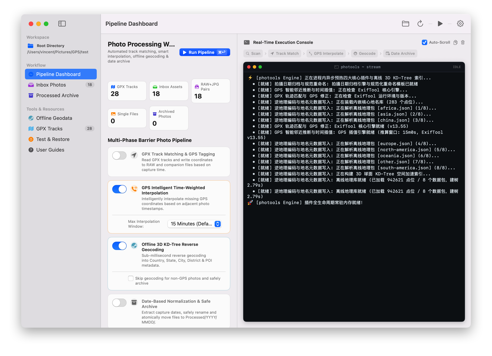
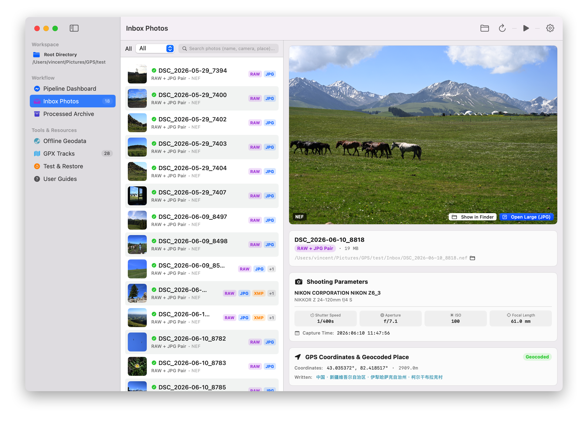
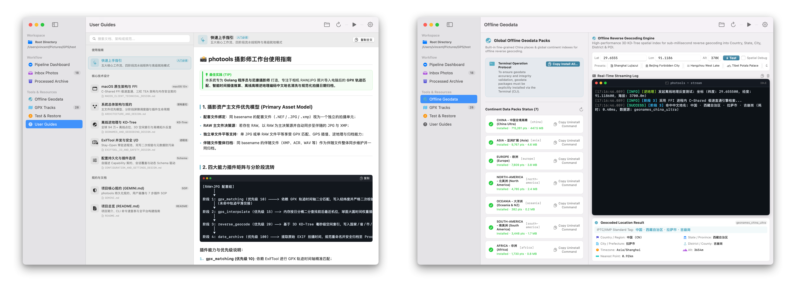

# 📸 photools

<p align="center">
  
</p>

<p align="center">
  <b>Turn your GPX tracks into GPS-tagged, location-aware photo libraries.</b><br/>
  <i>Automatic Geotagging, Intelligent Interpolation, Offline Reverse Geocoding & Date-Based Archiving for Photographers.</i>
</p>

<p align="center">
  <a href="README.md"><b>English</b></a> | <a href="README_zh.md"><b>简体中文</b></a>
</p>

<p align="center">
  <a href="https://github.com/vincentchyu/photools/releases/latest"></a>
  
  
  
  
</p>

---

## 💡 The Problem & The Story

> *"I took 4,000 RAW photos during a trekking trip in Xinjiang. My camera (Nikon / Sony / Canon / Fuji) didn't have built-in GPS, but my Apple Watch / Garmin / phone recorded the entire GPX track. How can I automatically geotag these photos, name the locations, and organize them into date folders without uploading anything to the cloud?"*

**photools** was built to solve this exact workflow friction:

```
Camera RAW/JPG Photos + GPX Tracks (Watch / Garmin / Phone)
                           ↓
                   ┌──────────────┐
                   │   photools   │
                   └──────────────┘
                           ↓
  📍 GPS Coordinates  +  🏙️ Real Location Names  +  📅 Date-Organized Folders
```

---

## ✨ Before & After (Real Transformation)

<table width="100%">
<tr>
<th width="50%">❌ Before photools</th>
<th width="50%">✅ After photools</th>
</tr>
<tr>
<td>

```text
📁 Inbox/
├── DSC_8123.NEF  (Nikon RAW)
├── DSC_8123.JPG
├── DSC_8124.NEF
└── DSC_8125.NEF

Metadata:
• GPS: None (0, 0)
• Location: Unknown
• Filename: Non-descriptive camera default
```

</td>
<td>

```text
📁 Processed/2025/0516/
├── 2025-05-16-DSC_8123.NEF
├── 2025-05-16-DSC_8123.JPG
├── 2025-05-16-DSC_8124.NEF
└── 2025-05-16-DSC_8125.NEF

Metadata (Embedded in EXIF / IPTC / XMP):
• GPS: 44.5912° N, 81.1684° E
• Location: China / Xinjiang / Ili / Sayram Lake
• Searchable in Lightroom, Apple Photos, Capture One!
```

</td>
</tr>
</table>

---

## 🍏 photools for macOS (Native Desktop App)

photools comes with a sleek, native macOS desktop application built with SwiftUI and high-performance in-process engine direct call (`libphotools.dylib`, sub-millisecond response).

<p align="center">
  <a href="https://github.com/vincentchyu/photools/releases/latest">
    
  </a>
</p>

### 📸 App Showcase

#### 1. Multi-Phase Pipeline Dashboard & Real-Time Log Console
> Configure your workspace, select processing plugins, and track the progress of every single photo in real-time.

<p align="center">
  
</p>

#### 2. Inbox Photo Library & Live EXIF Inspector
> Browse photos, inspect deep optical parameters (Shutter, Aperture, ISO, Lens Model), and test instant 3D KD-Tree reverse geocoding.

<p align="center">
  
</p>

#### 3. Offline Geodata Manager & User Documentation
> View offline reverse geocoding datasets and test coordinate lookups with zero network requests.

<p align="center">
  
</p>

---

## ⚡ The 4-Step Photography Workflow

```
[Inbox RAW/JPG] ──▶ 1. GPX Matching ──▶ 2. GPS Interpolate ──▶ 3. Reverse Geocode ──▶ 4. Date Archive ──▶ [Processed/YYYY/MMDD/]
```

1. **🗺️ GPX Track Matching (`gpx_matching`)**
   - Automatically synchronizes photo timestamps against multiple `.gpx` files with sub-second accuracy and time-offset compensation (`--geosync`).
   - Writes directly to Primary RAW (`.NEF`, `.ARW`, `.CR2/.CR3`, `.RAF`, `.DNG`) and seamlessly syncs to companion `.JPG` and `.XMP` files.
2. **🧠 Intelligent GPS Interpolation (`gps_interpolate`)**
   - Did you take burst shots, indoor photos, or shoot in a canyon with intermittent GPS coverage?
   - photools uses spherical great-circle time-weighted interpolation and nearest-station inheritance to accurately backfill missing coordinates between known locations.
3. **📍 Offline 5-Tier Reverse Geocoding (`reverse_geocode`)**
   - Powered by a 3D KD-Tree spatial index with offline geographic databases (e.g. 715k+ POIs).
   - Injects standardized Country, State/Province, City, District, and Scenic Spot / POI metadata directly into IPTC/XMP tags (100% offline, privacy-first).
4. **📅 Date-Based Atomic Archiving (`date_archive`)**
   - Extracts genuine `DateTimeOriginal`, standardizes filenames to `YYYY-MM-DD-basename`, and safely moves paired photo units into organized `Processed/YYYY/MMDD/` folders.

---

## 🛡️ Smart Metadata Tiering & Policy Architecture

Unlike traditional tools that either force modifying RAW binaries or only output detached sidecars, **photools** adopts an **Intent-Driven 4-Layer Metadata Model**:

```
                    Photography Metadata
                              │
         ┌────────────────────┼────────────────────┐
         ↓                    ↓                    ↓
    Tier 1: Original     Tier 2: Corrected    Tier 3: Derived & Tier 4: Workflow
     Camera Facts           GPS Truth               Location & Subjective
         │                    │                    │
   Camera/Lens/Shutter    GPX Matched GPS          5-Level Reverse Geocode
   DateTime/Native GPS    Interpolated GPS         Hierarchical Tags/Rating
         │                    │                    │
         ↓                    ↓                    ↓
    Preserve in RAW       Write to RAW EXIF        .nef.xmp Sidecar
                          Embed in Companion JPG   Embed in Companion JPG
                          Sync to .nef.xmp         (Never touches RAW)
```

### ⚙️ 4-Tier Writing Policies (`--sidecar-policy`)

| Policy | CLI Flag | Corrected Facts (GPS) | Derived Info (Location/Tags) | Use Case & Design Rationale |
| :--- | :--- | :--- | :--- | :--- |
| **Smart Tiered** *(Default)* | `smart` | **RAW EXIF + JPG Embed + XMP Sync** | **RAW Read-Only (`.xmp`) + JPG Embed** | **Golden Balance**: RAW permanently keeps GPS truth for native viewers; location tags live in XMP; JPGs work everywhere. |
| **Sidecar Only** | `sidecar_only` | Standalone `.xmp` | Standalone `.xmp` | Zero touch on RAW/JPG binary files. Perfect for read-only NAS archives. |
| **Embed & Sidecar** | `embed_and_sidecar` | Modify RAW & JPG | Modify RAW & JPG + Sync `.xmp` | Full dual-mirror synchronization. |
| **Embed Only** | `embed_only` | Modify RAW & JPG | Modify RAW & JPG (No XMP) | Minimalist mode without sidecar clutter. |

### 🔍 Metadata Provenance & Audit Fingerprints
When photools corrects or interpolates coordinates, it embeds audit trails directly into the XMP sidecar:
```xml
<rdf:Description rdf:about=""
  xmlns:photools="http://ns.photools.app/1.0/"
  photools:GPSSource="gpx"
  photools:GPSMatchMethod="time_proximity"
  photools:InterpolateWindow="15m"
  photools:Processor="photools v1.2.0"
  photools:ProcessedDate="2026-08-29T14:30:00+08:00" />
```

### 📂 Companion File Extension Whitelist (`--companion-exts`)
- Automatically tracks and atomically archives paired companion files (e.g. `wav` voice memos, `acr` presets, `exf`, `xmp`).
- Preserves full compound extensions during date-based renaming (`DSC_2948.nef.xmp` $\rightarrow$ `2026-01-01-DSC_2948.nef.xmp`).

---

## 🚀 Quick Start & Installation

### 🍺 Homebrew One-Line Install (Recommended for Developers & Keyboard Users)

For developers and power-users, you can install `photools` with Homebrew in one line:

```bash
# 1. Install CLI & Interactive TUI Workbench (Auto-installs exiftool & shell completions)
brew install vincentchyu/tap/photools

# 2. (Optional) Install macOS Native Desktop App (.app)
brew install --cask vincentchyu/tap/photools
```

> **Why Homebrew?**
> * ⚡ **Automatic Dependencies**: Installs core engine `exiftool` automatically.
> * ⌨️ **Shell Auto-Completion**: Installs full Zsh, Bash, and Fish Tab autocompletion out-of-the-box.
> * 🖥️ **Instant TUI Workbench**: Run `photools` or `photools tui` to launch the interactive Bubble Tea UI immediately.

---

### Option A: macOS Native App (Direct Download)
1. Download `photools-macOS.dmg` from [Releases](https://github.com/vincentchyu/photools/releases/latest).
2. Drag `photoolsApp.app` to your `/Applications` folder.
3. Open the app, select your photo folder & GPX files, and click **Run Pipeline**.

### Option B: Command Line (CLI) & Scripting
```bash
# Process photos with full automated pipeline (Smart Tiered Mode by default)
photools pipeline

# Specify metadata policy (smart / sidecar_only / embed_and_sidecar / embed_only)
photools pipeline --sidecar-policy=smart

# Specify companion file extensions to track (e.g. voice memos & ACR sidecars)
photools pipeline --companion-exts="wav,acr,exf"

# Enable GPS intelligent time-weighted interpolation (e.g. 30-minute window)
photools pipeline --interpolate=true --interpolate-window=30m

# In-Place / Flat Mode (Process, geocode, and standardize directly in the source folder)
photools pipeline --flat=true --in-place=true

# Soft degradation (Allow photos without GPS to still safely archive by date)
photools pipeline --allow-no-gps=true
```

### Option C: Interactive Terminal TUI Workbench
For terminal power-users and keyboard-driven workflows, photools includes a rich interactive TUI powered by Bubble Tea:

```bash
photools tui
```
- **`[1/2/3/4]` or `[Space]`**: Toggle capability plugins on the fly.
- **`[O]`**: Open plugin options modal (e.g. adjust search window, time offset).
- **`[S]`**: Global settings modal (cycle through 4-tier sidecar policies with `[Space]`, `[Tab]` path completion).
- **`[Enter]`**: Trigger Dry-Run inspection, followed by execution.

---

## 🛠️ For Developers & Advanced Users (Architecture & Technical Reference)

photools is engineered with an emphasis on extreme performance, modularity, and zero memory leaks.

### 🏗️ Technical Architecture & Key Highlights
* **ExifTool Stay-Open Daemon Pool**: Eliminates repetitive `fork/exec` overhead by managing persistent worker pools (`exiftool -stay_open True -@ -`). Photo metadata reads drop from ~30ms to **1.2ms/op**.
* **$O(\log K)$ Spherical `AnchorIndex`**: In-memory date-bucketed binary search tree that locates nearest shooting stations in **205 ns/op**.
* **3D KD-Tree Spatial Index**: Converts (Latitude, Longitude) into 3D Cartesian coordinates on an Earth sphere radius ($R = 6371	ext{ km}$), enabling millisecond-level nearest-neighbor Chinese administrative POI lookups without network I/O.
* **Go C-Shared FFI Direct Link**: SwiftUI natively calls Go core capabilities via `libphotools.dylib` with strict pointer lifetime and memory safety guarantees (`defer { fnFreeString(ptr) }`).

### 📊 Benchmark (Apple M1 Max, `arm64`)

```bash
go test -run=^$ -bench=. -benchmem ./internal/capabilities/gpsinterpolate/...
```

| Benchmark Target | Latency / op | Throughput | Memory Alloc | Notes |
| :--- | :---: | :---: | :---: | :--- |
| **`AnchorIndex` Binary Search (10k pts)** | **`205 ns/op`** | `4,870,000 ops/sec` | `0 B/op` | Zero heap allocation |
| **`AnchorIndex` Batch Tree Build (1k assets)** | **`0.52 ms/op`** | `1,920 batches/sec` | `24 KB/op` | Date-bucketed index |
| **`ExecuteProcess` Per-Photo Interpolation** | **`0.11 ms/op`** | `8,880 photos/sec` | `1.2 KB/op` | Great-circle weighting |
| **`ExifTool` Stay-Open Daemon Pool** | **`1.2 ms/op`** | `830 reads/sec` | 0 fork | Persistent daemon pool |

---

### 📦 Building from Source

#### Requirements
- **Go**: `1.21+`
- **Swift / Xcode Command Line Tools**: `Swift 5.9+` (for macOS Native App)
- **ExifTool**: `12.0+` (`brew install exiftool`)

#### 1. Compile Core Go Binaries & Dynamic Library
```bash
# 1. Compile Go C-Shared dynamic library (for Swift GUI)
go build -buildmode=c-shared -o dist/libphotools.dylib ./cmd/photools-cshared

# 2. Compile standalone CLI & TUI binary
go build -ldflags="-s -w" -o dist/photools ./cmd/photools
```

#### 2. Install Offline Geodata (Required for Reverse Geocoding)
```bash
# Install China high-precision dataset (715k+ POIs, saved to ~/.config/photools/geodata/)
./dist/photools geodata install china

# Optional: Install other continental datasets
./dist/photools geodata install asia
./dist/photools geodata install europe
./dist/photools geodata install north-america
```

#### 3. Build macOS App Bundle & Distributable DMG
```bash
# Build standalone App Bundle (Output: dist/photoolsApp.app)
./script/build_and_run.sh --build-only

# Package into a distributable .dmg installer
hdiutil create -volname "photools" -srcfolder dist/photoolsApp.app -ov -format UDZO dist/photools-macOS.dmg
```

---

## 📚 Deep-Dive Technical Design Documents

For in-depth architectural and implementation specifications, see the dedicated design docs:

- 📖 **[System Architecture & Phased Scheduler Design](docs/ARCHITECTURE_AND_DESIGN.md)**
- 🏷️ **[ExifTool Metadata Specification & Software Compatibility Matrix](docs/EXIFTOOL_METADATA_SPECIFICATION.md)**
- 🍏 **[macOS Native Client Architecture & C-Shared FFI Design](docs/MACOS_CLIENT_TECHNICAL_DESIGN.md)**
- 🛡️ **[ExifTool Stay-Open Daemon Pool & Data Safety Design](docs/EXIFTOOL_IO_AND_SAFETY_DESIGN.md)**
- 🗺️ **[GeoNames Offline Data Pack & 3D KD-Tree Spatial Index Design](docs/GEONAMES_AND_GEOCODING_DESIGN.md)**
- ⚙️ **[Configuration Schema & Dynamic Settings Panel Design](docs/CONFIGURATION_AND_SETTINGS_DESIGN.md)**

---

## 📄 License

photools is open-source software licensed under the [MIT License](LICENSE).
