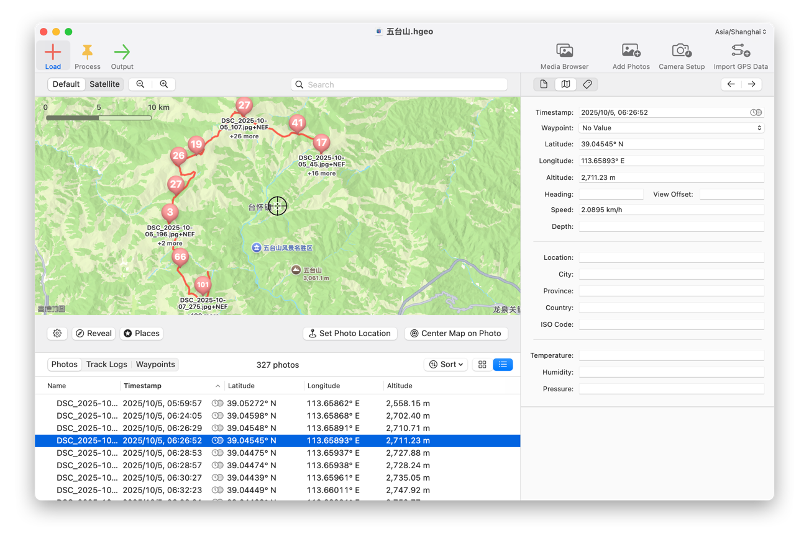

[简体中文](#photo-processing) | [English](#photo-processing-en)

<h1 id="photo-processing">photo-processing</h1>

这是一个面向摄影工作流的自动化处理工具集，目前提供两大核心功能：
1. **GPS 修正 (`geotag`)**：在照片从相机同步到电脑后，结合移动设备导出的 `GPX` 轨迹，为照片批量补充写入 GPS 坐标。
2. **照片归档整理 (`organize-by-date`)**：根据照片元数据中的拍摄日期，对照片及其配套文件（RAW、JPG、XMP 等）进行按日期的归档与规范化重命名。

项目当前采用 `Go CLI + exiftool` 的方式工作，重点解决“导入电脑后的元数据补充与文件整理”环节，不扩展成完整的 DAM 或后期管理系统。



## 项目目标

- 将同 basename 的配套文件视为一个拍摄单元，至少包含 `RAW + JPG`，并可带 `XMP`、`ACR`、`WAV` 等 companion files。
- 以 `RAW` 作为元数据权威源。
- 使用照片自身的 `DateTimeOriginal + OffsetTimeOriginal` 与 `GPX` 轨迹进行匹配。
- 先为 `RAW` 写入 GPS，再把 `GPS:all` 同步到同名 `JPG`，并在存在 `XMP` 时同步到 `XMP`。
- 按照片原始拍摄日期归档到 `Processed/YYYY/MMDD/`。
- 所有用户可见日志和输出统一使用中文。

## 目录结构

```text
GPS/
├── cmd/photools/          # 统一 CLI 工具入口
├── macos/PhotoToolsApp/   # Mac 原生 SwiftUI 工作台
├── internal/              # 内部核心逻辑
│   ├── exiftool/          # ExifTool 交互与元数据操作
│   ├── geotag/            # GPS 修正业务逻辑
│   └── organizer/         # 资产发现与归档整理逻辑
├── Inbox/                 # 相机同步到电脑后的待处理照片
├── GPX/                   # 移动设备导出的轨迹文件
├── Processed/             # 按拍摄日期归档后的照片
├── Logs/                  # 中文日志
└── CORE_CONSTRAINTS.md    # 项目核心约束
```

## 依赖要求

- Go `1.26.2`
- [ExifTool](https://exiftool.org/)

先确认命令可用：

```bash
go version
exiftool -ver
```

## 使用方式

### 1. 准备目录

- 把待处理照片放进 `Inbox/`
- 把轨迹文件放进 `GPX/`

工具默认使用基础目录：
```text
$HOME/Pictures/GPS
```

---

### 2. 交互式 TUI 终端工作台（🌟 强烈推荐）

直接在终端运行（无需记复杂参数）：
```bash
go run ./cmd/photools
```
或显式进入 TUI：
```bash
go run ./cmd/photools tui
```
- **向导式主菜单**：一键切换 GPS 修正与归档、按日期归档整理、资产预检体检；
- **Dry-Run 预检清单**：执行前评估配对情况、GPX 覆盖范围、潜在冲突与预警；
- **实时流水线看板**：双栏显示执行阶段进度条、当前处理资产及滚动中文日志；
- **交互式异常结算**：就地排查未匹配项（如缺少配对 JPG、GPX 时间断层）与解决建议。

---

### 3. Mac 原生图形工作台

轻量 SwiftUI 原生应用，用于可视化查看 `Inbox/GPX/Processed/Logs` 状态：
```bash
./script/build_and_run.sh
```

---

### 4. 命令行（CLI）脚本模式

适合 CI、定时脚本或喜欢原生参数调用的场景：

- **标准 GPS 修正**：
  ```bash
  go run ./cmd/photools geotag
  ```
- **指定时间偏移**：
  ```bash
  go run ./cmd/photools geotag -geosync +00:00:05
  ```
- **指定基础目录与并发数**：
  ```bash
  go run ./cmd/photools geotag -base-dir /path/to/GPS -workers 8
  ```
- **按拍摄日期整理指定目录**：
  ```bash
  go run ./cmd/photools organize-by-date -source-dir /path/to/source -target-dir /path/to/output
  ```

## 当前处理规则


### 配对规则

- 同 basename 的文件会被识别为一个拍摄单元。
- `RAW + JPG` 是进入 GPS 修正流程的最小核心组合。
- 只有 `RAW` 没有 `JPG` 时，任务会记录“等待配对 JPG”，不会提前归档。
- 只有 `JPG` 没有 `RAW` 时，任务会跳过，不单独处理。
- 同 basename 的 `XMP`、`ACR`、`WAV` 等 companion files 会和主文件一起归档。

### 并发规则

- `Inbox` 中的资产组会按 basename 分组后并发处理。
- 并发粒度是“拍摄单元”，不是单个文件。
- 同一拍摄单元内部仍按固定顺序执行：`RAW` -> `JPG` -> `XMP` -> 归档。
- 可通过 `-workers` 控制并发数，默认使用当前机器的 CPU 核心数。

### 时间与 GPS 规则

- 默认信任照片中的 `DateTimeOriginal` 和 `OffsetTimeOriginal`。
- 默认 `geosync=0`。
- 如相机时钟有误差，可通过 `-geosync` 传入偏移值。
- 多个 `GPX` 文件会逐个传给 `exiftool`，不会拼成单一参数。

### 写入与校验规则

- GPS 先写入 `RAW`。
- 工具不会只看 `exiftool` 退出码，还会二次校验 `RAW` 是否真的出现 `GPSPosition`。
- `RAW` 成功后，再把 `GPS:all` 同步到 `JPG`。
- 如果同 basename 存在 `XMP`，会继续把 GPS 同步到 `XMP`。
- 同步后会再次校验 `JPG` 和 `XMP` 是否存在有效 GPS。
- 如果照片时间在当前 `GPX` 中找不到可用插值，整组文件会继续保留在 `Inbox/`，不会被错误归档。

### 归档与规范化重命名规则

成功处理后，同 basename 的整组文件将被提取拍摄日期，进行规范化重命名，并归档到 `Processed/YYYY/MMDD/` 目录下。

重命名规则会在原文件编号前自动插入 `YYYY-MM-DD` 格式的日期。扩展名通常保持不变（视具体动作而定）。

**归档成果示例：**

假设 `Inbox/` 有两组拍摄于 `2025-10-06` 的资产，执行整理或 geotag 后，你的 `Processed/` 目录将呈现如下结构：

```text
Processed/
└── 2025/
    └── 1006/
        ├── DSC_2025-10-06_1010.NEF       # 主 RAW 文件
        ├── DSC_2025-10-06_1010.JPG       # 同步过 GPS 的 JPG
        ├── DSC_2025-10-06_1010.xmp       # 附加的 XMP 配置文件
        ├── DSC_2025-10-06_1011_edit.NEF  # 带有自定义后缀的文件
        └── DSC_2025-10-06_1011_edit.JPG
```

### 独立整理命令

- `organize-by-date` 是独立子命令，不依赖 `Inbox/GPX/Processed` 这套 GPS 修正目录结构。
- 它会遍历 `-source-dir` 下的全部文件，并按 basename 聚合。
- 每组文件会尝试找到一个带 `DateTimeOriginal` 的照片文件作为锚点。
- 找到后，会把这组文件整体移动到 `-target-dir/YYYY/MMDD/`。
- 这个命令按顺序处理，不启用并发移动。
- 如果一组文件里没有任何文件能读出 `DateTimeOriginal`，这组文件会保留在原目录，并生成待处理清单。

## 日志说明

日志文件路径：

```text
Logs/geotag.log
```

待处理清单路径：

```text
Logs/inbox_pending_report_latest.md
```

按拍摄日期整理命令的日志和待处理清单路径：

```text
<target-dir>/_organize_logs/organize_by_date.log
<target-dir>/_organize_logs/organize_pending_report_latest.md
```

终端输出和日志文件语义一致，均为中文。常见信息包括：

- `开始处理`
- `已加载 GPX 轨迹文件`
- `发现未配对的 JPG，暂不处理`
- `等待配对 JPG`
- `照片时区`
- `RAW 的 GPS 写入成功`
- `RAW 的 GPS 坐标未变化`
- `已同步 GPS 到 JPG`
- `已归档到`
- `处理失败`

如果本次运行中有文件因为缺少配对、轨迹未命中或其他原因被保留在 `Inbox/`，工具会生成一份待处理清单，至少包含：

- 资产 basename
- 失败或待补原因
- 建议动作
- 涉及的 companion files
- 拍摄时间和时区
- 本次参与匹配的 `GPX` 文件列表

## 测试

运行测试：

```bash
go test ./...
```

## 设计边界

这个项目当前明确不做以下事情：

- 不做完整的摄影资产管理系统
- 不把 `JPG` 当作与 `RAW` 同级的权威元数据源
- 不以内嵌 EXIF 解析重写 `exiftool`

如果后续要扩展新能力，请先阅读 [CORE_CONSTRAINTS.md](/Users/vincent/Pictures/GPS/CORE_CONSTRAINTS.md)。

---

<h1 id="photo-processing-en">photo-processing (English)</h1>

This is an automated processing toolkit for photography workflows, currently providing two core functions:
1. **GPS Correction (`geotag`)**: After syncing photos from camera to computer, batch write GPS information to photos using `GPX` tracks exported from mobile devices.
2. **Photo Archive & Organization (`organize-by-date`)**: Automatically archive and rename photos and their companion files (RAW, JPG, XMP, etc.) based on the shooting date in the metadata.

The project currently uses `Go CLI + exiftool`, focusing on "metadata enrichment and file organization after import," and does not intend to expand into a full DAM or post-processing system.


## Project Goals

- Treat companion files with the same basename as a single "shooting unit" (at least `RAW + JPG`, plus `XMP`, `ACR`, `WAV`, etc.).
- Use `RAW` as the authoritative source of metadata.
- Match `GPX` tracks using the photo's `DateTimeOriginal + OffsetTimeOriginal`.
- Write GPS to `RAW` first, then sync `GPS:all` to the same-named `JPG`, and to `XMP` if it exists.
- Archive photos to `Processed/YYYY/MMDD/` based on the original shooting date.
- All user-visible logs and output are unified in Chinese (technical labels remain English).

## Directory Structure

```text
GPS/
├── cmd/photools/          # Unified CLI entry
├── macos/PhotoToolsApp/   # Native Mac SwiftUI workbench
├── internal/              # Internal core logic
│   ├── exiftool/          # ExifTool interaction & metadata ops
│   ├── geotag/            # GPS correction business logic
│   └── organizer/         # Asset discovery & archive logic
├── Inbox/                 # Pending photos from camera
├── GPX/                   # Track files from mobile devices
├── Processed/             # Photos archived by date
├── Logs/                  # Chinese logs
└── CORE_CONSTRAINTS.md    # Core project constraints
```

## Requirements

- Go `1.26.2`
- [ExifTool](https://exiftool.org/)

Verify commands:

```bash
go version
exiftool -ver
```

## Usage

### 1. Prepare Directories

- Place pending photos in `Inbox/`
- Place track files in `GPX/`

The tool uses the base directory by default:

```text
$HOME/Pictures/GPS
```

### 2. Execution

Default run:

```bash
go run ./cmd/photools geotag
```

Organize specific directory by date:

```bash
go run ./cmd/photools organize-by-date -source-dir /path/to/source -target-dir /path/to/output
```

Specify base directory:

```bash
go run ./cmd/photools geotag -base-dir /Users/username/Pictures/GPS
```

Specify time offset:

```bash
go run ./cmd/photools geotag -geosync +00:00:05
```

Specify RAW extensions:

```bash
go run ./cmd/photools geotag -raw-exts nef,cr3,arw,dng
```

Specify concurrent workers:

```bash
go run ./cmd/photools geotag -workers 4
```

### 3. Mac Workbench

The project also includes a thin SwiftUI workbench for a friendlier local workflow. It displays `Inbox/GPX/Processed/Logs` status, starts `geotag`, and shows live logs plus the pending report. It does not rewrite GPS logic; it still calls `photools geotag` underneath.

Launch the local workbench:

```bash
./script/build_and_run.sh
```

Verify that the app builds and starts:

```bash
./script/build_and_run.sh --verify
```

## Processing Rules

### Pairing Rules

- Files with the same basename are identified as one shooting unit.
- `RAW + JPG` is the minimum core combination for the GPS correction process.
- If `RAW` is missing its `JPG`, the task records "waiting for JPG" and won't archive early.
- If `JPG` is missing its `RAW`, the task is skipped (not processed alone).
- Companion files (XMP, ACR, WAV, etc.) move with the primary files.

### Concurrency Rules

- Asset groups in `Inbox` are processed concurrently by basename.
- The unit of concurrency is the "shooting unit," not individual files.
- Order within a unit is fixed: `RAW` -> `JPG` -> `XMP` -> Archive.
- Concurrent workers can be controlled via `-workers` (default is CPU core count).

### Time & GPS Rules

- Trust `DateTimeOriginal` and `OffsetTimeOriginal` by default.
- Default `geosync=0`.
- Camera clock drift can be compensated using `-geosync`.
- Multiple `GPX` files are passed to `exiftool` individually.

### Writing & Validation Rules

- GPS is written to `RAW` first.
- The tool validates `GPSPosition` presence after the command finishes.
- After `RAW` success, sync `GPS:all` to `JPG`.
- If `XMP` exists, sync GPS to `XMP` as well.
- Re-validate `JPG` and `XMP` after syncing.
- Photos outside track ranges stay in `Inbox/` and aren't archived.

### Archive & Normalization Rules

After successful processing, files are renamed and archived to `Processed/YYYY/MMDD/`.

Renaming automatically inserts `YYYY-MM-DD` before the original number. Extensions typically remain unchanged (subject to specific action).

**Archive Example:**

If `Inbox/` has two units shot on `2025-10-06`, after processing:

```text
Processed/
└── 2025/
    └── 1006/
        ├── DSC_2025-10-06_1010.NEF       # Primary RAW
        ├── DSC_2025-10-06_1010.JPG       # Synced JPG
        ├── DSC_2025-10-06_1010.xmp       # Sidecar XMP
        ├── DSC_2025-10-06_1011_edit.NEF  # Custom suffix
        └── DSC_2025-10-06_1011_edit.JPG
```

### Independent Organization Command

- `organize-by-date` is an independent subcommand.
- It scans `-source-dir` and groups by basename.
- Attempts to find a `DateTimeOriginal` anchor in the group.
- Moves the entire group to `-target-dir/YYYY/MMDD/`.
- Processed sequentially (no concurrency for this command).

## Logs

Log paths:

```text
Logs/geotag.log
Logs/inbox_pending_report_latest.md
```

Organization command logs:

```text
<target-dir>/_organize_logs/organize_by_date.log
<target-dir>/_organize_logs/organize_pending_report_latest.md
```

## Testing

Run tests:

```bash
go test ./...
```

## Design Boundaries

This project explicitly DOES NOT:

- Serve as a full DAM system.
- Treat `JPG` as an authoritative source alongside `RAW`.
- Re-implement EXIF writing (uses `exiftool`).

Read [CORE_CONSTRAINTS.md](./CORE_CONSTRAINTS.md) for further development.
