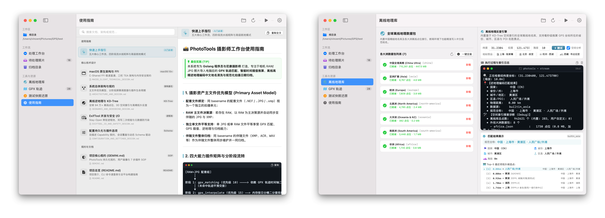
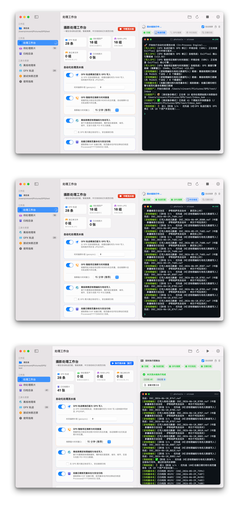
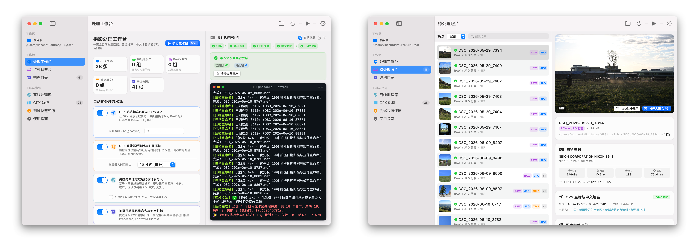

# 📸 photools 摄影资产处理工具箱

<p align="center">
  
</p>

<p align="center">
  <b>面向摄影师的高性能照片元数据自动化处理、GPS 智能推算与离线中文地名归档工具箱</b>
</p>

<p align="center">
  <a href="README.md"><b>English</b></a> | <a href="README_zh.md"><b>简体中文</b></a>
</p>

<p align="center">
  
  
  
  
  
</p>

---

## 🌟 项目定位与概述

**photools** 是专为摄影师（支持尼康 RAW `.NEF`、索尼 `.ARW`、佳能 `.CR2/.CR3`、富士 `.RAF`、徕卡 `.DNG`、Apple ProRAW 及高质量 JPG）打造的自动化元数据处理工具集。

彻底解决相机照片导入电脑后的繁琐整理工作：
1. **GPX 轨迹精准对齐**：将相机拍摄时间戳与移动设备 GPX 轨迹进行亚秒级时间轴匹配；
2. **GPS 智能邻近推算**：对未命中轨迹照片，依据前后照片时间权重进行球面大圆插值与近邻继承；
3. **离线 3D KD-Tree 高精逆地理编码**：纯离线环境下毫秒级写入国家、省份、城市、区县、风景区 POI 中文地名；
4. **按拍摄日期规范化原子归档**：提取真实拍摄日期，规范重命名（`YYYY-MM-DD-basename`）并安全原子归档至 `Processed/YYYY/MMDD/`。

---

## 🖥️ macOS 原生桌面端界面展示 (App Showcase)

photools 原生客户端采用 SwiftUI 打造，结合 Go 语言编译的 `libphotools.dylib` 进程内 C-Shared FFI 极速直通（~0.1ms 响应），提供丝滑稳定的原生操作体验，**支持无需重启即可在设置中一键即时切换简体中文与 English**。

### 1. 工作区配置与离线逆地理反查工具
> **左侧**：引导式配置 `待处理 (Inbox)`、`轨迹 (GPX)` 与 `归档库 (Processed)`，环境自检状态实时就绪。<br/>
> **右侧**：内置 3D KD-Tree 离线逆地理地名反查工具，毫秒级反查经纬度对应的五级中文规范地名。

<p align="center">
  
</p>

---

### 2. 多阶段流水线执行过程差异全景 (阶段 1 ➔ 阶段 2 ➔ 阶段 3)
> 完整呈现多阶段屏障流水线在执行中的差异演进，进度条流转、实时日志流、阶段状态变化与事件审计 100% 清晰呈现，零重叠遮挡。

<p align="center">
  
</p>

---

### 3. 执行完成审计看板与待处理诊断清单
> **左侧**：处理完成汇总看板，清晰呈现总资产数、打标成功数、插值推算数与归档目标路径。<br/>
> **右侧**：待处理与异常诊断清单，智能归类无 GPS、超出窗口或待复核资产，并提供一键排查报告（`Logs/inbox_pending_report_latest.md`）。

<p align="center">
  
</p>

---

## ⚡ 四大核心能力插件 (Core Capabilities)

```
[待处理照片 RAW/JPG] ──▶ 1. GPX 轨迹匹配 ──▶ 2. GPS 智能插值 ──▶ 3. 离线逆地理 ──▶ 4. 拍摄日期归档 ──▶ [归档库/YYYY/MMDD/]
                            (P10 · 阶段 1)       (P15 · 阶段 2)      (P20 · 阶段 3)       (P100 · 阶段 4)
```

| 核心插件 | 优先级 | 阶段 | 功能说明 |
| :--- | :---: | :---: | :--- |
| **`gpx_matching`** | `P10` | `阶段 1` | **GPX 轨迹精准匹配**：从 GPX 目录读取轨迹，为 RAW 主文件写入经纬度并无污染同步到伴随 JPG/XMP。 |
| **`gps_interpolate`** | `P15` | `阶段 2` | **GPS 智能邻近推断与时间插值**：对未命中轨迹照片，利用 $O(\log K)$ 纳秒级 `AnchorIndex` 进行球面大圆时间加权插值或同机位继承。 |
| **`reverse_geocode`** | `P20` | `阶段 3` | **离线高精逆地理编码**：基于 3D KD-Tree 离线索引将国家、省、市、区、风景名胜 POI 中文地名写入 IPTC/XMP 标签。 |
| **`date_archive`** | `P100` | `阶段 4` | **按拍摄日期规范归档**：提取 EXIF 拍摄日期，规范重命名并安全原子移动至 `Processed/YYYY/MMDD/` 目录。 |

---

## 🚀 交互式终端 TUI 工作台 (Terminal TUI)

适合键盘流与终端用户，基于 Bubble Tea 构建：

```bash
# 启动交互式 TUI 工作台
./photools tui
```

```text
╭────────────────────────────────────────────────────────────────────────────╮
│ ⚡ 流水线能力插件自检与装载 (Capabilities Self-Check & Loading)...         │
│  [✔] 就绪   GPX 轨迹匹配与 GPS 修正 (ExifTool v12.76)                       │
│  [✔] 就绪   GPS 智能邻近推断与时间插值 (推算窗口: 15m)                      │
│  [⚙️] 装载中 逆地理编码与地名元数据写入 [china.json] (927,314 点位 62%)      │
│  [✔] 就绪   按拍摄日期归档与规范重命名                                      │
╰────────────────────────────────────────────────────────────────────────────╯
```

- **`[1/2/3/4]` 或 `[空格]`**：自由切换对应插件开关；
- **`[O]`**：调出当前光标选中插件的专属自描述设置面板（如推算窗口、时间偏移量）；
- **`[S]`**：进入全局设置（工作区目录、原地扁平模式、并发数、无 GPS 容错策略，支持 `[Tab]` 路径补全）；
- **`[Enter]`**：进入 Dry-Run 预检看板，再次按 `[Enter]` 立即执行。

---

## 🛠️ CLI 命令行用法

### 1. 复合流水线 (`pipeline`)
```bash
# 执行全部流水线能力 (默认启用 GPX 匹配 + 逆地理 + 归档)
photools pipeline

# 开启 GPS 智能插值推算 (指定推算窗口为 1 小时)
photools pipeline --interpolate=true --interpolate-window=1h

# 启用扁平原地模式（原地扫描、原地逆地理打标并原地规范化重命名）
photools pipeline --flat=true --in-place=true

# 软降级容错模式（无 GPS 照片跳过地名打标直接安全归档）
photools pipeline --allow-no-gps=true
```

### 2. 独立子命令
```bash
# 标准 GPS 轨迹修正 (支持时间偏移补偿 +5 秒)
photools geotag -geosync +00:00:05 -workers 8

# 独立离线逆地理地名打标
photools geocode -dir /path/to/Inbox

# 独立按拍摄日期整理归档
photools organize-by-date -source-dir /path/to/source -target-dir /path/to/output

# 深度 EXIF 元数据检查 (机型/镜头/曝光四要素/GPS/IPTC)
photools inspect /path/to/photo.NEF

---

## 📦 项目构建与打包分发指引 (Build & Packaging)

### 1. 环境依赖要求
- **Go 语言**: `1.21+`
- **Swift / Xcode 命令行工具**: `Swift 5.9+` (构建 macOS 原生应用)
- **ExifTool**: `12.0+` (`brew install exiftool`)

---

### 2. 后端核心组件构建 (Go C-Shared & CLI)

photools 后端由 Go 语言编写，包含两个核心构建目标：

```bash
# 1. 编译 Go C-Shared 动态库 (提供给 Swift GUI 进程内直通，产物: dist/libphotools.dylib)
go build -buildmode=c-shared -o dist/libphotools.dylib ./cmd/photools-cshared

# 2. 编译独立 CLI 命令行与 TUI 工具 (产物: dist/photools)
go build -ldflags="-s -w" -o dist/photools ./cmd/photools
```

> [!NOTE]
> **内嵌映射字典说明 (`//go:embed data`)**：
> `internal/geodata/data/` 目录下的中英文地名/行政区划字典（`admin1CodesASCII_zh.json`, `admin2Codes_zh.json`, `country_codes.json` 等）会在编译期**自动内嵌打包进 `libphotools.dylib` 与 `photools` 二进制**中。分发给其他用户时随动态库自带，无需手动拷贝字典文件。如需重新生成字典可执行 `python3 internal/geodata/data/generate_all.py`。

---

### 3. 离线高精地理数据包安装 (必须执行)

为了实现高精度的 3D KD-Tree 离线逆地理编码（如反查中国大陆 71.5 万 POI/省市区地名），需要安装对应地区的离线地理数据库。**由于数据包体积较大，高精坐标库不会内嵌进动态库中，新环境必须显式安装一次**：

```bash
# 1. 检查当前本地地理包安装状态
./dist/photools geodata status

# 2. 安装中国大陆高精离线地理包 (强烈推荐，安装至 ~/.config/photools/geodata/)
./dist/photools geodata install china

# 3. (可选) 按需安装全球其它大洲数据包
./dist/photools geodata install asia       # 亚洲
./dist/photools geodata install europe     # 欧洲
./dist/photools geodata install north-america # 北美
```

---

### 4. macOS 原生自包含 App 打包 (`.app` & `.dmg`)

photools 提供了全自动一体化打包脚本 [`script/build_and_run.sh`](script/build_and_run.sh)，自动完成 Go C-Shared 动态库（`libphotools.dylib`）编译、Swift 原生应用构建、CLI 引擎嵌入、ExifTool 运行时内置、`@rpath` 动态链接配置与本地 Ad-hoc 代码签名：

```bash
# 1. 一键构建自包含绿色版 App Bundle (产物路径: dist/photoolsApp.app)
./script/build_and_run.sh --build-only

# 2. 构建并立即启动测试
./script/build_and_run.sh run

# 3. 制作 macOS 标准分发 DMG 安装镜像 (分发给其他人)
hdiutil create -volname "photools" -srcfolder dist/photoolsApp.app -ov -format UDZO dist/photools-macOS.dmg
```

**自包含 App Bundle 目录结构 (`dist/photoolsApp.app`)**：
```text
photoolsApp.app/
└── Contents/
    ├── MacOS/
    │   ├── photoolsApp       # SwiftUI 原生主程序
    │   └── photools            # 内置 Go 独立 CLI 引擎
    ├── Frameworks/
    │   └── libphotools.dylib   # 进程内 C-Shared FFI 极速动态库 (~0.1ms，内置内嵌映射字典)
    ├── Resources/
    │   ├── docs/               # 离线技术设计与使用手册
    │   └── vendor/exiftool/    # 内置 ExifTool 运行时 (实现免安装自包含)
    └── Info.plist
```

> [!IMPORTANT]
> **分发给其他用户注意事项**：
> 打包为 `.dmg` 分发给其他用户后，客户端调用 `libphotools.dylib` 会自动读取内嵌的翻译字典。若对方需要使用离线逆地理反查功能，对方电脑首次需在终端执行 `photools geodata install china` 下载离线坐标库，或由管理员将 `~/.config/photools/geodata/` 数据包一同分发部署。

---

### 5. 独立 CLI / TUI 跨平台编译与分发

编译极小体积、无调试符号的高性能 CLI 独立二进制：

```bash
# 本地编译 (剥离调试符号)
go build -ldflags="-s -w" -o photools ./cmd/photools

# 跨平台分发交叉编译
# macOS Apple Silicon (arm64)
CGO_ENABLED=0 GOOS=darwin GOARCH=arm64 go build -ldflags="-s -w" -o dist/photools-darwin-arm64 ./cmd/photools

# macOS Intel (amd64)
CGO_ENABLED=0 GOOS=darwin GOARCH=amd64 go build -ldflags="-s -w" -o dist/photools-darwin-amd64 ./cmd/photools

# Linux x86_64 (amd64)
CGO_ENABLED=0 GOOS=linux GOARCH=amd64 go build -ldflags="-s -w" -o dist/photools-linux-amd64 ./cmd/photools
```

---

## 📊 性能基准与压测表现 (Benchmarks)

在 **Apple Silicon (M1 Max, arm64)** 环境下的实测性能表现：

```bash
go test -run=^$ -bench=. -benchmem ./internal/capabilities/gpsinterpolate/...
```

| 压测目标 | 单次操作延迟 | 吞吐量 (QPS) | 内存分配 |
| :--- | :---: | :---: | :---: |
| **`AnchorIndex` 二分检索 (10,000 点位)** | **`205 ns/op`** | **`4,870,000 ops/sec`** | `0 B/op` |
| **`AnchorIndex` 批次索引构建 (1,000 资产)** | **`0.52 ms/op`** | **`1,920 批次/秒`** | `24 KB/op` |
| **`ExecuteProcess` 单张插值与动态合入** | **`0.11 ms/op`** | **`8,880 张/秒`** | `1.2 KB/op` |
| **`ExifTool` Stay-Open 常驻守护池** | **`1.2 ms/op`** | **`830 次/秒`** | 消除进程重复 fork |

---

## ⚙️ 配置文件说明 (`plugins.json`)

系统在首次启动时会自动在 `~/.config/photools/plugins.json` 生成持久化配置：

```json
{
  "plugins": [
    {
      "id": "gpx_matching",
      "name": "GPX 轨迹匹配与 GPS 修正",
      "priority": 10,
      "enabled": true
    },
    {
      "id": "gps_interpolate",
      "name": "GPS 智能邻近推断与时间插值",
      "priority": 15,
      "enabled": true,
      "options": {
        "window": "15m"
      }
    },
    {
      "id": "reverse_geocode",
      "name": "逆地理编码与地名元数据写入",
      "priority": 20,
      "enabled": true
    },
    {
      "id": "date_archive",
      "name": "按拍摄日期归档与规范重命名",
      "priority": 100,
      "enabled": true
    }
  ]
}
```

---

## 📖 技术架构与深度文档

- 📖 **[系统架构与分阶段屏障调度器设计文档](docs/ARCHITECTURE_AND_DESIGN.md)**
- 🍏 **[macOS 原生客户端架构与 C-Shared FFI 技术设计文档](docs/MACOS_CLIENT_TECHNICAL_DESIGN.md)**
- ⚙️ **[配置模式与动态设置面板设计文档](docs/CONFIGURATION_AND_SETTINGS_DESIGN.md)**
- 🛡️ **[ExifTool Stay-Open 守护池与数据安全设计文档](docs/EXIFTOOL_IO_AND_SAFETY_DESIGN.md)**
- 🗺️ **[GeoNames 离线数据包与 3D KD-Tree 空间索引设计文档](docs/GEONAMES_AND_GEOCODING_DESIGN.md)**

---

## 📄 开源许可证

本项目基于 [MIT License](LICENSE) 开源。
