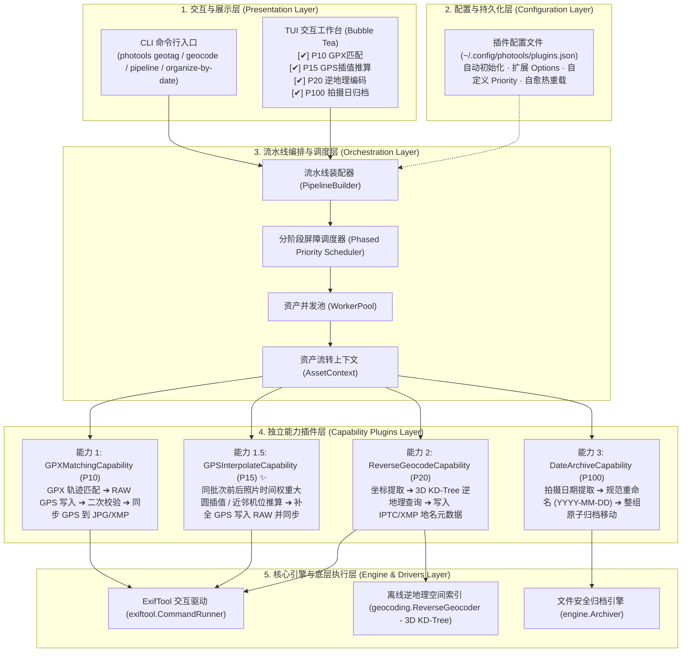
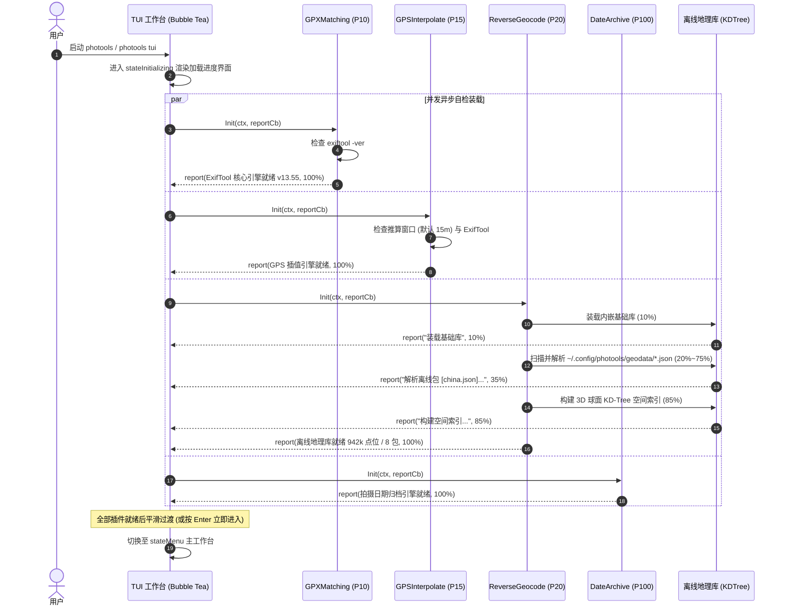
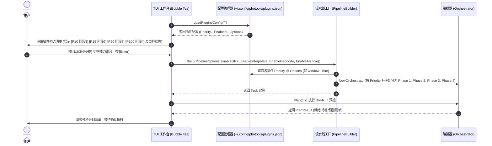
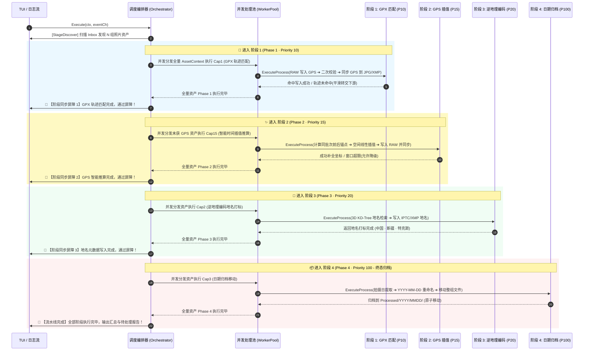
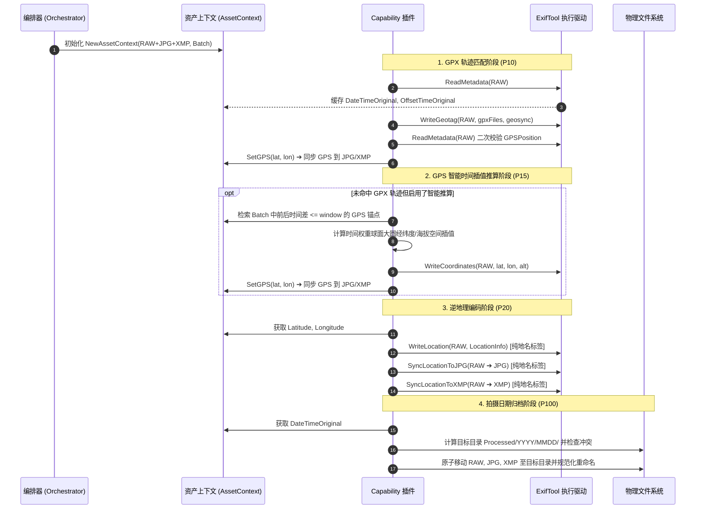

# PhotoTools 插件化流水线与能力解耦架构设计文档

本文档详细说明 `photools` 的系统分层架构、四大核心能力插件协议、基于 Priority 的分阶段同步屏障调度器、配置文件生命周期以及详尽的业务时序图。

---

## 1. 总体分层架构 (System Architecture)



---

## 2. 领域模型与接口契约

### 2.1 能力插件接口 (`domain.Capability`)

```go
type Capability interface {
    // ID 返回插件全局唯一标识符 (如 "gpx_matching", "gps_interpolate", "reverse_geocode", "date_archive")
    ID() CapabilityID

    // Name 返回插件中文友好名称
    Name() string

    // Description 返回功能描述
    Description() string

    // RequiredStage 返回该能力对应的流水线阶段 (如 StageGeotag, StageGeocode, StageArchive)
    RequiredStage() PipelineStage

    // Priority 返回插件默认执行优先级 (数值越小越优先执行)
    Priority() int

    // Init 异步初始化自检与流式汇报 (如检查 ExifTool、加载 8 大洲 94 万离线点位并构建 KD-Tree)
    Init(ctx context.Context, report func(PluginInitReport)) error

    // PlanPrecheck 对单资产进行轻量预检 (Dry-Run)，评估依赖条件与动作描述 (严格区分阻塞 Warning 与良性跳过)
    PlanPrecheck(ctx context.Context, actx *AssetContext) CapabilityPlan

    // ExecuteProcess 执行具体业务逻辑 (写入 Exif、插值推算、查询地名、移动归档)
    ExecuteProcess(ctx context.Context, actx *AssetContext, sendEvent func(ProgressEvent)) error
}
```

### 2.2 插件自检汇报与健康模型 (`domain.PluginInitReport`)

```go
type PluginHealthStatus string

const (
    HealthReady    PluginHealthStatus = "ready"    // 正常就绪 (工具链完备，数据包已建树)
    HealthDegraded PluginHealthStatus = "degraded" // 降级运行 (如未装外挂数据包，降级到内置轻量库)
    HealthFailed   PluginHealthStatus = "failed"   // 初始化失败 (如关键命令行缺失)
)

type PluginInitReport struct {
    PluginID CapabilityID       `json:"plugin_id"`
    Name     string             `json:"name"`
    Stage    string             `json:"stage"`   // 当前步骤 (如 "装载离线数据包", "构建 KD-Tree")
    Message  string             `json:"message"` // 详细提示信息
    Percent  float64            // 0.0 ~ 1.0 (-1 表示不确定进度)
    Status   PluginHealthStatus // 当前健康状态
    Err      error              // 错误信息
}
```

### 2.3 资产流转上下文 (`domain.AssetContext`)

单个拍摄单元（同 basename 的 `RAW + JPG + XMP`）在整个流水线生命周期中共享同一个上下文对象，并可安全访问批次全景元数据（`Batch`），实现邻近照片时间权重计算：

```go
type AssetContext struct {
    mu sync.RWMutex

    // 拍摄单元物理文件
    Asset AssetGroup

    // 缓存的元数据与解析结果
    Metadata    Metadata
    HasGPS      bool
    Latitude    float64
    Longitude   float64
    Altitude    float64
    Location    *LocationInfo
    TargetDir   string
    NewBaseName string

    // 批次全量元数据引用 (用于前后邻近时间差空间插值)
    Batch []*AssetContext

    // 状态标记
    ModifiedFiles []string
    Skipped       bool
    SkipReason    string
}
```

---

## 3. 基于 Priority 的阶段同步屏障调度机制

### 3.1 调度规则
1. **分阶段分桶 (Priority Buckets)**：
   编排器将用户启用的所有 Capability 按 `Priority()` 升序分组为有序阶段列表：
   $$\text{Phase}_1 (P=10) \longrightarrow \text{Phase}_2 (P=15) \longrightarrow \text{Phase}_3 (P=20) \longrightarrow \text{Phase}_4 (P=100)$$
2. **串行阶段推进与屏障 (Stage Synchronization Barrier)**：
   全量照片必须在 $\text{Phase}_k$ 全部完成（或平滑流转/跳过）并通过阶段屏障后，调度器才会统一触发 $\text{Phase}_{k+1}$。
3. **多阶段平滑交接与容错降级**：
   - 阶段 1 未命中 GPX 轨迹时，平滑流转至阶段 2 进行时间权重空间插值；
   - 彻底无 GPS 的照片在开启 `--allow-no-gps` 时，在逆地理阶段良性跳过，安全进入阶段 4 按拍摄日期规范归档。
4. **同阶段安全并发**：
   同一个 Phase 内部如果配置了相同 Priority 的多个插件，将在当前阶段内对资产组协同并发执行。
5. **破坏性操作隔离**：
   归档移动插件（`DateArchiveCapability`）固定拥有最低优先级（$P=100$），确保绝不会在元数据清洗打标完成前提前移动文件。

---

## 4. 核心业务时序图 (Mermaid Sequence Diagrams)

### 4.1 启动阶段：插件并发自检与流式装载时序图



---

### 4.2 TUI 插件选择与流水线动态装配时序图



---

### 4.3 全量资产分阶段同步屏障执行时序图



---

### 4.4 单拍摄单元 (RAW + JPG + XMP) 底层执行时序图



---

## 5. 配置文件生命周期与规范 (`plugins.json`)

### 5.1 存储路径与自愈机制
- **默认全局路径**：`~/.config/photools/plugins.json`
- **环境变量覆盖**：`PHOTOOLS_PLUGINS_CONFIG`
- **增量自愈机制**：系统冷启时自动比对当前文件与内置默认配置，若缺少新插件（如 `gps_interpolate`）或缺少扩展 `options`（如 `window: "15m"`），将自动增量补齐并重新排序写回磁盘，同时完好保留用户已自定义的优先级数值与开关。

### 5.2 配置文件完整结构示例
```json
{
  "plugins": [
    {
      "id": "gpx_matching",
      "name": "GPX 轨迹匹配与 GPS 修正",
      "priority": 10,
      "enabled": true,
      "description": "从 GPX 目录读取轨迹为 RAW 写入经纬度并同步到 JPG/XMP"
    },
    {
      "id": "gps_interpolate",
      "name": "GPS 智能邻近推断与时间插值",
      "priority": 15,
      "enabled": true,
      "description": "根据同批次前后邻近照片时间权重，自动推算补全无轨迹照片 GPS 坐标",
      "options": {
        "window": "15m"
      }
    },
    {
      "id": "reverse_geocode",
      "name": "逆地理编码与地名元数据写入",
      "priority": 20,
      "enabled": true,
      "description": "根据 GPS 坐标检索国家/省/市/区/POI，写入 IPTC/XMP 地名元数据"
    },
    {
      "id": "date_archive",
      "name": "按拍摄日期归档与规范重命名",
      "priority": 100,
      "enabled": true,
      "description": "提取 EXIF 拍摄日期，规范重命名并安全归档至 Processed/YYYY/MMDD/"
    }
  ]
}
```
