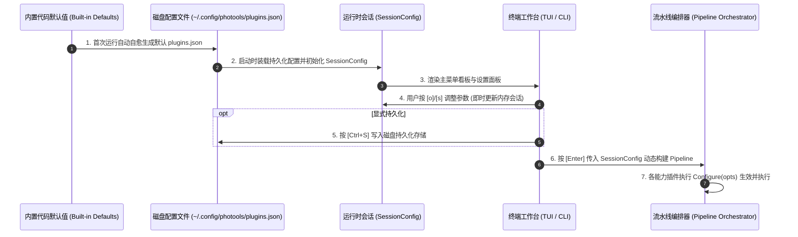

# ⚙️ photools 全局设置与插件专属配置架构设计规范

本文档详尽阐述 photools 摄影工作流系统的**统一配置抽象、插件自描述契约、多级存储流转与交互驱动体系**。

---

## 1. 架构演进与设计动机

### 1.1 历史痛点
- **参数硬编码与耦合**：插件的可调参数（如 P10 的 `geosync`、P15 的 `window`）过去分散写死在 CLI `main.go`、TUI 渲染层和 Pipeline 构建器中，每新增或修改一个参数需跨层级改动 5~6 个文件；
- **配置边界模糊**：全局环境（工作区、并发数、模式）与插件特有参数混杂在一起，用户难以直观理解哪些参数会影响哪个阶段；
- **终端交互阻滞**：TUI 中路径输入无法利用系统 Shell 级别的 Tab 自动补全，按 Tab 键在“焦点切换”与“路径补全”之间发生语义冲突；
- **会话与持久化未分层**：临时微调的参数容易意外污染全局磁盘配置，或无法方便地持久化保存摄影师的偏好。

### 1.2 核心设计目标
1. **两级正交解耦（Orthogonal Separation）**：严格隔离“全局环境与安全调度配置”与“插件专属配置”；
2. **插件自描述与自配置契约（Self-Describing Capability）**：插件完全内聚管理自身支持的配置元数据（类型、说明、默认值、预设候选），外层 UI 纯动态驱动渲染；
3. **三层生命周期流转（Three-Tier Lifecycle）**：内置默认 ➔ 磁盘持久化（`plugins.json`） ➔ 运行时会话热覆盖（`SessionConfig`）；
4. **智能焦点与智能 Tab 补全（Context-Aware Tab Completion）**：在路径输入框内支持公共前缀补全与多候选轮转，非路径项顺畅流转光标。

---

## 2. 两级配置正交模型 (Two-Tier Configuration Model)

```mermaid
graph TD
    User["摄影师用户 (TUI / CLI)"]
    
    subgraph "⚙️ 全局环境与调度配置 (Global Settings)"
        BaseDir["BaseDir (根工作区)"]
        SourceDir["SourceDir (源扫描目录)"]
        FlatMode["FlatMode (扁平原地模式)"]
        AllowNoGPS["AllowNoGPS (无 GPS 软降级容错)"]
        RawExts["RawExtensions (RAW 格式切片)"]
        Workers["Workers (并发线程数)"]
        Backup["EnableBackup (测试快照备份)"]
    end
    
    subgraph "🧩 插件专属自描述配置 (Plugin Settings)"
        P10["P10 gpx_matching<br>• geosync: 时钟偏差偏移值"]
        P15["P15 gps_interpolate<br>• window: 插值推算时间窗口"]
        P20["P20 reverse_geocode<br>• language: 地名语言格式"]
        P100["P100 date_archive<br>• in_place: 原地规范重命名模式"]
    end
    
    User -->|按 [s] 键全局调优| Global Settings
    User -->|光标选中按 [o] 键微调| Plugin Settings
    Global Settings & Plugin Settings --> Session["SessionConfig (运行时会话上下文)"]
    Session --> Pipeline["Pipeline Task 动态装配与阶段屏障执行"]
```

### 2.1 全局环境与调度配置 (`GlobalSettings`)
由 `internal/config/schema.go` 统一定义，控制整个流水线的运行容器与安全策略：

| 配置项 | 类型 | 默认值 | 作用说明 |
| :--- | :--- | :--- | :--- |
| **`BaseDir`** | `string` | `~/Pictures/GPS` | 工作区根目录，用于定位默认的 `Inbox/`、`GPX/` 与 `Processed/` |
| **`SourceDir`** | `string` | `<BaseDir>/Inbox` | 当前批次照片扫描源路径，支持指定任意外部磁盘目录 |
| **`LogDir`** | `string` | `~/.logs/photools` | 全局日志与待补清单报告输出目录，杜绝在工作区产生 `Logs/` 垃圾文件 |
| **`GPXDir`** | `string` | `~/.config/gpx` | GPX 轨迹文件统一存放目录 |
| **`FlatMode`** | `bool` | `false` | 扁平直接目录模式：忽略分层，就地扫描并就地打标/原地重命名 |
| **`SidecarPolicy`** | `string` | `smart` | 智能元数据分层模式（`smart`/`sidecar_only`/`embed_and_sidecar`/`embed_only`） |
| **`AllowNoGPS`** | `bool` | `false` | 软降级容错：无 GPS 照片在逆地理阶段良性跳过，安全进入拍摄日期归档 |
| **`RawExtensions`** | `[]string` | `nef, cr3, arw, dng...` | 识别为 RAW 摄影主文件的扩展名列表 |
| **`Workers`** | `int` | `CPU 核心数` | 并发 Worker 线程池大小 |
| **`EnableBackup`** | `bool` | `false` | 测试备份模式：在破坏性操作前自动快照备份原始文件至 `Inbox_bak/` |

### 2.2 插件专属配置与自描述契约 (`OptionSpec`)
每个插件独立实现 `SupportedOptions() []OptionSpec` 与 `Configure(opts map[string]any) error`：

```go
// OptionSpec 声明插件特有选项的元数据描述（供 TUI / CLI 动态构建界面与校验）
type OptionSpec struct {
    Key          string        // 配置键 (如 "window", "geosync", "in_place")
    Name         string        // 用户可见标题 (如 "推算最大时间窗口")
    Description  string        // 选项作用说明
    Type         OptionType    // 类型 (OptionTypeString, OptionTypeBool, OptionTypeDuration, OptionTypeInt)
    DefaultValue any           // 默认值
    Choices      []string      // 预设候选列表 (用于 TUI 单选或轮转，如 ["15m", "30m", "1h", "2h"])
}
```

各核心插件自描述 Schema 矩阵：
1. **`gpx_matching` (P10)**：
   - `geosync` (`OptionTypeString`): 相机与 GPS 的时间补偿偏移值（候选：`"0"`, `"+00:00:05"`, `"-00:01:00"`）；
2. **`gps_interpolate` (P15)**：
   - `window` (`OptionTypeDuration`): 前后邻近锚点最大推算时间差（候选：`"15m"`, `"30m"`, `"1h"`, `"2h"`, `"4h"`）；
3. **`reverse_geocode` (P20)**：
   - `language` (`OptionTypeString`): 地名输出语言标准（候选：`"zh-CN"`, `"en"`）；
4. **`date_archive` (P100)**：
   - `in_place` (`OptionTypeBool`): 是否在源目录原地重命名而不创建分层子目录（候选：`"false"`, `"true"`）。

---

## 3. 三层生命周期与存储流转 (Three-Tier Lifecycle)

系统保证配置在生命周期中的单向流动与可控持久化：



---

## 4. TUI 交互与焦点智能分流设计

### 4.1 全局设置面板交互 (`stateGlobalSettings`)
- **按键映射**：
  - `[↑] / [k]`：向上移动设置项焦点；
  - `[↓] / [j]`：向下移动设置项焦点；
  - `[Space] / [Enter]`：切换布尔开关（如 FlatMode、AllowNoGPS、EnableBackup）；
  - `[Ctrl+S]`：持久化保存至 `~/.config/photools/plugins.json`；
  - `[Esc]`：放弃或返回主菜单。
- **Tab 智能分流（Context-Aware Tab Completion）**：
  - **当焦点位于路径输入框（如 BaseDir / SourceDir）**：
    - 按 `[Tab]` 触发 `engine.CompleteDirectoryPath` 智能补全；
    - 若有多个候选，连续按 `[Tab]` 在候选之间循环轮转，输入框下方即时渲染高亮 Badges；
  - **当焦点位于开关、数字或非路径项**：
    - 按 `[Tab]` 等同于顺畅下移输入焦点，保证键盘流的连贯性。

### 4.2 插件专属设置面板交互 (`statePluginSettings`)
- **纯动态元数据驱动**：
  - 用户光标停留在任一插件卡片上按 `[o]`，TUI 自动根据该插件返回的 `SupportedOptions()` 动态渲染专属设置面板；
  - 对于带 `Choices` 的选项（如推算窗口 `15m / 30m / 1h / 2h`），按 `[Space]` 或 `[Enter]` 在预设候选列表中快速循环轮转；
  - 彻底杜绝针对特定插件的外部写死 `switch-case` 渲染逻辑。

### 4.3 流水线执行前全景看板 (`stateConfig`)
在正式 Dry-Run 预检前，向摄影师全景展示即将执行的决策链路：
- **板块 1：阶段流转与插件参数总览**（P10 Geosync、P15 Window、P20 Language、P100 InPlace）；
- **板块 2：全局运行环境与安全策略**（工作区路径、扁平/分层模式、Worker 并发数、软降级容错状态、安全快照备份）；
- **板块 3：核心参数现场微调**（支持 ↑/↓ 移动与 Tab 补全 SourceDir）。

---

## 5. 工程闭环与测试保障

配置系统具备 100% 完整的单元测试与自动化验证：
1. **Schema 校验与类型转换测试**：`internal/config/schema_test.go` 全量覆盖布尔、Duration、字符串解析与异常输入回退；
2. **插件自描述契约测试**：各插件 `capability_test.go` 均包含 `SupportedOptions()` 与 `Configure()` 专项测试；
3. **Tab 自动补全测试**：`internal/tui/model_test.go` 中的 `TestModel_TabCompletion` 断言路径补全与候选轮转。
