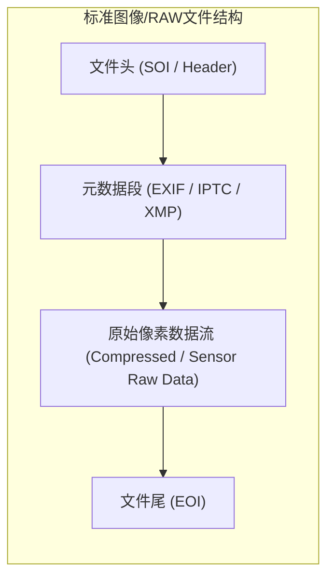
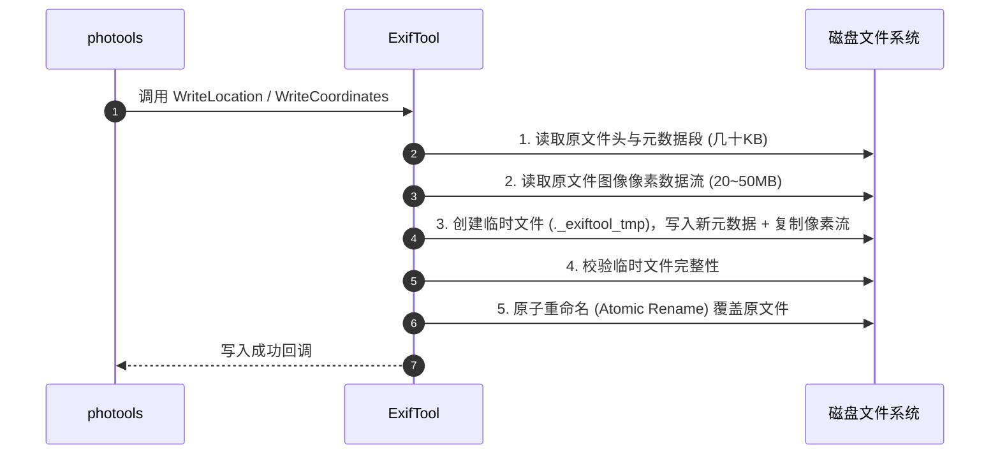

# ExifTool I/O 读写机制与数据安全设计文档

本文档详细说明 `photools` 底层依赖的 **ExifTool** 在读取、写入和同步元数据（GPS 经纬度、逆地理编码地名、时间戳等）时的底层 I/O 运行机制、全量数据流流转原理以及数据安全保障策略。

---

## 1. 核心问题与现象

在使用 `photools` 执行 GPS 轨迹匹配（`gpxmatch`）、GPS 智能插值（`gpsinterpolate`）或逆地理编码打标（`reversegeocode`）时，系统监控（如 iStat Menus、活动监视器）通常会显示：

> **现象**：处理一张 20MB ~ 50MB 的 RAW/JPG 照片时，产生约等同于照片大小的磁盘读取量与写入量。

许多用户会产生疑问：**“既然只是修改或追加几百字节的地理文本，为什么会有整张照片全量的磁盘 I/O？这样会不会破坏原始照片或损坏 RAW 传感器数据？”**

**结论**：这是所有主流图像处理工具（包括 Adobe Lightroom、Capture One、Apple Photos、ExifTool）在遵循图像文件格式规范下的**标准工业行为**，**绝对不会造成照片损坏或画质损失**。

---

## 2. 为什么元数据修改必须“全量读写”？

### 2.1 图像文件的物理存储结构

常见的数字图像与 RAW 文件（JPEG、CR2/CR3、NEF、ARW、DNG、TIFF 等）在物理二进制结构上由顺序排列的数据段（Segments / IFD Blocks）组成：



1. **头部与元数据区（Header & Metadata Segments）**：通常位于文件最前端（前几 KB 到数百 KB）。
2. **像素/RAW 传感器数据区（Image Sensor Data）**：占据文件 99% 以上的空间（数 MB 到数十 MB），紧随元数据段之后。

### 2.2 为什么无法在原位置“定点就地修改”（In-Place Edit）？

* **元数据长度动态变化**：追加逆地理编码（如国家、省份、城市、POI 名称）或 GPS 坐标时，XMP/IPTC 块的字节长度会显著增长。
* **物理偏移量（Offset）后移**：因为元数据位于图像数据之前，元数据体积膨胀会导致后续所有图像像素数据在文件中的物理偏移地址整体向后移动。
* **数据流重写机制（Stream Copy）**：
  ExifTool 修改元数据时的真实执行过程为：
  1. 读取原文件的头部并解析元数据；
  2. 在内存中合成新的元数据段；
  3. 创建临时文件，写入新文件头与新元数据；
  4. **将原文件中的巨量图像像素数据以纯二进制数据流（Byte Stream）原封不动拷贝到临时文件后部**；
  5. 校验写入完成后，原子替换原文件。



因此，系统监控到的读写量是**纯字节数据流复制**引起的正常 I/O。

---

## 3. 数据安全与完整性保障机制

| 安全特性 | 实现原理与技术细节 |
| :--- | :--- |
| **纯二进制流复制（100% 无损）** | ExifTool 仅作为容器级解包与重新打包器，**绝不会解压、重新压缩、重新编码或修改任何图像像素数据与 RAW 传感器拜耳阵列数据**。 |
| **原子性重命名保护（Atomic Rename）** | 写入过程中若发生断电、系统崩溃或强制终止，原照片完全不受影响，因为写入操作始终在临时文件进行，只有完全写完才会触发操作系统的原子重命名。 |
| **时间戳与文件属性保护 (`-P`)** | `photools` 在所有 ExifTool 写入指令中均附带 `-P` 参数，确保修改元数据后，文件的原始创建时间与系统修改时间（FileModifyDate）得以完整保留。 |
| **编码安全性 (`-charset UTF8`)** | 针对中文字符（国家、省份、城市），强制指定 `-charset UTF8` 和 `-codedcharacterset=utf8`，彻底杜绝 IPTC/XMP 乱码风险。 |
| **20+ 年工业级验证** | 由 Phil Harvey 开发的 ExifTool 是全球影像领域公认的元数据事实标准，经过了全球数十亿张各类相机厂商 RAW 格式的实战验证。 |

---

## 4. `photools` 的 ExifTool 参数与调用规范

在 `internal/exiftool/exiftool.go` 中，所有写操作均严格遵循安全与最佳实践标准：

### 4.1 写入 GPS 坐标与高度
```bash
exiftool -overwrite_original -P \
  -GPSLatitude=39.904200 -GPSLatitudeRef=N \
  -GPSLongitude=116.391700 -GPSLongitudeRef=E \
  -GPSAltitude=50.00 -GPSAltitudeRef=0 \
  TARGET_PHOTO.RAW
```

### 4.2 写入逆地理编码地名（IPTC + XMP 双写）
```bash
exiftool -overwrite_original -P \
  -charset UTF8 -codedcharacterset=utf8 \
  -XMP-photoshop:Country="中国" -IPTC:Country-PrimaryLocationName="中国" \
  -XMP-iptcCore:CountryCode="CN" -IPTC:Country-PrimaryLocationCode="CHN" \
  -XMP-photoshop:State="北京市" -IPTC:Province-State="北京市" \
  -XMP-photoshop:City="东城区" -IPTC:City="东城区" \
  TARGET_PHOTO.RAW
```

### 4.3 批量只读解析优化（并发只读）
对于只读提取元数据场景（如扫描与建立索引），`photools` 采用多协程并发分批（Batch Chunk）并指定 `-m -q -json` 参数，仅读取必要的标签，避免无谓的磁盘开销：
```bash
exiftool -m -q -json -DateTimeOriginal -OffsetTimeOriginal -GPSPosition -GPSDateTime file1.raw file2.raw ...
```

---

## 5. 极致安全的替代方案：XMP 侧车文件模式（Sidecar）

如果您希望原始 RAW 文件保持 **100% 物理只读**（完全不修改 RAW 文件本身任何一个字节），可以采用 **XMP 侧车伴随文件（Sidecar .xmp）** 策略：

1. **元数据写入 XMP**：将 GPS 坐标与地名直接写入与 RAW 同名的 `.xmp` 文本文件（如 `DSC0001.xmp`）。
2. **零 RAW I/O**：修改和读写仅发生在几 KB 的 XML 文本文件中，RAW 文件保持原封不动。
3. **专业软件无缝识别**：Lightroom、Capture One、Darktable、Photoshop 均会自动读取同目录同名 `.xmp` 侧车文件中的地理信息。

`photools` 内部已全面支持 `SyncGPSToXMP` 与 `SyncLocationToXMP`，确保在伴随 XMP 存在时实现多端元数据同步。
