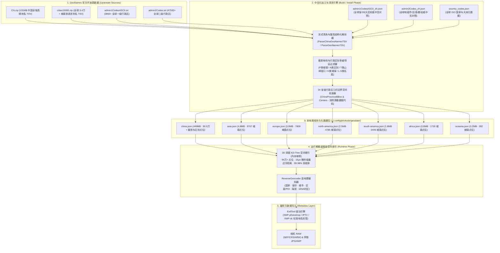
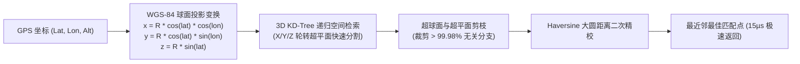
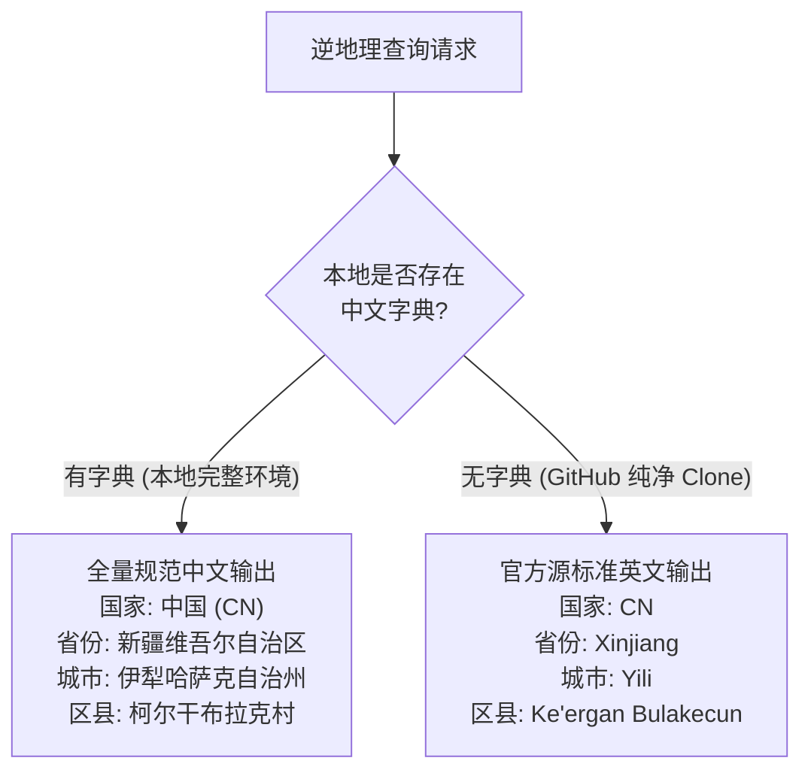

# 🗺️ GeoNames 地理数据体系、中文化清洗与 3D KD-Tree 索引设计文档

本文档详细说明 `photools` 的 **GeoNames 离线地理数据体系**、**全球行政区划与地名中文化清洗引擎**、**两阶段解耦生命周期模型**、**3D 球面 KD-Tree 空间索引算法**以及**全流程离线逆地理编码（Reverse Geocoding）与元数据写入规范**。

---

## 1. 总体架构与数据流拓扑 (Architecture & Dataflow)

整个地理数据体系分为 **“构建与安装期（数据清洗与烘焙）”** 与 **“运行期（纯离线空间检索）”** 两个完全解耦的阶段：



---

## 2. 两阶段生命周期模型 (Two-Phase Decoupled Lifecycle)

### 2.1 构建/安装期 (Build / Install Phase)
- **触发命令**：`photools geodata install china` 或 `photools geodata install all`；
- **职责**：将上游海量非结构化 TSV 数据加工为适合摄影工作流的结构化 `GeoPoint` 列表并固化落盘；
- **字典注入**：通过内嵌或外挂的 `admin1CodesASCII_zh.json`、`admin2Codes_zh.json` 与 `country_codes.json`，将原始代码（如 `admin1: "13"`, `admin2: "6540"`, `country: "CN"`）转换为标准规范中文（`"新疆维吾尔自治区"`, `"伊犁哈萨克自治州"`, `"中国"`）；
- **产物**：生成完全烘焙完毕的 `~/.config/photools/geodata/*.json`。

### 2.2 日常运行期 (Runtime Phase)
- **触发场景**：TUI 交互流水线、`photools geocode` 独立命令、`photools geodata test` 空间测试；
- **职责**：**纯离线只读** `~/.config/photools/geodata/*.json`；
- **零外部开销**：在冷启动时一次性载入内存构建 3D KD-Tree，单次查询仅耗时 **15 微秒（0.015 ms）**；
- **零字典依赖**：点位结构体中已完整固化国家、省、市、区中文名，日常打标不再产生任何额外翻译与字典查询开销。

---

## 3. 数据结构定义 (`domain.GeoPoint`)

离线数据包与内存索引统一采用如下强类型 `GeoPoint` 结构体：

```go
type GeoPoint struct {
    GeoNameID    int64   `json:"geoname_id"`              // GeoNames 官方唯一全球数字 ID (如 11980835)
    Name         string  `json:"name"`                    // UTF-8 原始地名 (如 "Ke’ergan Bulakecun")
    NameASCII    string  `json:"name_ascii"`              // ASCII 字母地名 (如 "Ke'ergan Bulakecun")
    NameZH       string  `json:"name_zh"`                 // 中文规范地名/POI (如 "柯尔干布拉克村")
    Lat          float64 `json:"lat"`                     // WGS-84 纬度 (-90.0 ~ +90.0)
    Lon          float64 `json:"lon"`                     // WGS-84 经度 (-180.0 ~ +180.0)
    FeatureClass string  `json:"feature_class"`           // 要素大类 (P:城镇, A:行政区, T:山川, H:水系, L/S:名胜古迹)
    FeatureCode  string  `json:"feature_code"`            // 要素详细代码 (PPLC, ADM2, MT, LK, PRK, RES 等)
    CountryCode  string  `json:"country_code"`            // ISO 2位国家代码 (如 "CN", "US", "JP")
    Country      string  `json:"country"`                 // 中文国家规范名 (如 "中国", "日本", "美国")
    Admin1Code   string  `json:"admin1_code"`             // 一级行政区代码 (如 "13", "CA", "40")
    Admin2Code   string  `json:"admin2_code,omitempty"`   // 二级行政区/地级代码 (如 "6540", "075", "13101")
    Province     string  `json:"province"`                // 规范省/州/大区名称 (如 "新疆维吾尔自治区")
    City         string  `json:"city"`                    // 规范地级市/区县名称 (如 "伊犁哈萨克自治州")
    District     string  `json:"district,omitempty"`      // 规范区县/POI/乡镇名称 (如 "柯尔干布拉克村")
    Population   int64   `json:"population,omitempty"`    // 常住人口统计
    Elevation    int     `json:"elevation,omitempty"`     // 测绘海拔 (米)
    DEM          int     `json:"dem,omitempty"`           // SRTM 数字高程模型海拔 (米)
    Timezone     string  `json:"timezone,omitempty"`      // IANA 标准时区标识符 (如 "Asia/Urumqi")
    ModDate      string  `json:"mod_date,omitempty"`      // 官方源最后更新日期 (YYYY-MM-DD)
    Source       string  `json:"source"`                  // 数据源标识 (如 "geonames_china_ultra")
}
```

---

## 4. 全球中文化清洗与翻译引擎设计

### 4.1 字典体系架构
系统通过三层中文字典提供权威规范的地名与区划翻译：

1. **[`admin1CodesASCII_zh.json`](file:///Users/vincent/Pictures/GPS/internal/geodata/data/admin1CodesASCII_zh.json)** (3,865 条)
   - 覆盖全球 228 个国家和地区的全部一级行政区（省/州/大区/都道府县/构成国/共和国等）；
   - 保存字段：`code`, `name`, `name_ascii`, `name_zh`, `geoname_id`。

2. **[`admin2Codes_zh.json`](file:///Users/vincent/Pictures/GPS/internal/geodata/data/admin2Codes_zh.json)** (47,592 条)
   - 覆盖全球二级行政区（地级市/州/盟/区/县/郡/堂区/自治市镇等）；
   - 深度融合 GB/T 2260 4位国标地级市代码与全球各主要国家二级行政区译名。

3. **[`country_codes.json`](file:///Users/vincent/Pictures/GPS/internal/geodata/data/country_codes.json)** (250+ 条)
   - 全球 ISO 2位代码、中文规范国名及所属大洲归属。

### 4.2 专属国别中文化解析器
- **中国 (CN)**：
  - 一级区划：FIPS/ISO/GB 省份代码映射为国家标准 34 省份/直辖市/自治区/特别行政区全称；
  - 二级区划：依据 `admin2Code`（4位国标码，如 `6540`、`6531`）直接映射为地级市/自治州全称（如 `伊犁哈萨克自治州`、`喀什地区`）；
  - 空间包围盒纠错：维护中国 34 省地理边界（`ChinaProvinceBBox`），若源数据代码脏污或缺失，自动依据经纬度几何定位纠错。
- **日本 (JP)**：
  - 都道府县 + 市町村区（`-ku` -> 区, `-shi` -> 市, `-cho`/`-machi` -> 町, `-mura` -> 村, `-gun` -> 郡），内嵌 Hepburn 罗马字汉字对应字典。
- **韩国 (KR)**：
  - 17 广域自治团体 + 市郡区（`-si` -> 市, `-gun` -> 郡, `-gu` -> 区），内嵌标准汉字词汇表。
- **欧美及全球**：
  - 通用复合行政词缀剥离与重构（`City and County of ...` -> `...市县`, `County of ...` -> `...县`, `Municipality of ...` -> `...市`, `Parish of ...` -> `...堂区`, `District of ...` -> `...区` 等）；
  - 专名音译引擎：遵循新华社《世界人名翻译大辞典》与联合国标准汉字音译规范音节表，生成自然流畅的标准中文译名。

---

## 5. 3D 球面 KD-Tree 空间索引算法细节

为了在离线 94 万+ 点位中实现微秒级最近邻匹配，系统采用了基于 3D 笛卡尔坐标系的球面 KD-Tree。



### 5.1 空间坐标投影数学模型
标准大地经纬度（$\text{lat}, \text{lon}$）经由地球平均半径 $R = 6371.0\text{ km}$ 投影至三维空间点 $P(x, y, z)$：

$$x = R \cdot \cos(\text{lat}) \cdot \cos(\text{lon})$$

$$y = R \cdot \cos(\text{lat}) \cdot \sin(\text{lon})$$

$$z = R \cdot \sin(\text{lat})$$

### 5.2 性能表现
- **建树复杂度**：$O(N \log N)$（94 万点位建树仅需约 2.6 秒，冷启动全局单例构建一次）；
- **查询复杂度**：$O(\log N)$（单次查询平均遍历 128 个节点，耗时 **15~16 微秒**，剪枝率达 **99.98%**）；
- **距离度量**：三维空间欧氏距离粗筛结合 Haversine 大圆距离二次精确过滤。

---

## 6. 摄影要素多重特征过滤规则 (`isUsefulChinaFeature`)

为了保证摄影工作流输出的地名兼具**行政规范性**与**自然/人文摄影地标识别度**，系统在清洗时执行严格的 Feature 过滤：

| 要素大类 | 特征代码 (Feature Codes) | 典型地物与应用场景 |
| :--- | :--- | :--- |
| **P 类 (城镇居民点)** | `PPLC`, `PPLA`, `PPLA2`, `PPLA3`, `PPLA4`, `PPL`, `PPLX` | 首都、省会、地级市中心、县城、乡镇、村庄 |
| **A 类 (行政区域)** | `ADM1`, `ADM2`, `ADM3`, `ADM4`, `ADMD` | 省份、地级市、区县、行政公署、旗/盟 |
| **T 类 (地貌与山川)** | `MT`, `MTS`, `PK`, `PKS`, `VLY`, `GLCR`, `PASS`, `GAP`, `RDGE`, `CLIFF`, `ISL`, `PT`, `HLL` | 著名山峰、山脉、峡谷、冰川、公路垭口、岬角、海岛 |
| **H 类 (水系与湿地)** | `LK`, `LKS`, `WTRH`, `FLL`, `STM`, `BAY`, `RSV` | 高原湖泊、大河、瀑布、海湾、水库、湿地 |
| **L / S 类 (人文名胜)** | `PRK`, `RES`, `TMPL`, `MNMT`, `RUIN`, `SPA`, `CST`, `MUS`, `AIRP`, `RSTN`, `BDG` | 国家公园、自然保护区、寺庙、古迹、桥梁、地标建筑 |

---

## 7. 零硬编码与平滑降级契约 (Fallback Contract)

整个系统底层**严禁出现任何地名中文字符串硬编码**，完全由数据驱动：



---

## 8. CLI 运维与数据管理指令指南

```bash
# 1. 查看各大洲离线数据包状态与安装点位数
photools geodata list

# 2. 安装/重建中国全境高精离线数据包 (90.9万点位)
photools geodata install china

# 3. 一键安装/重建全球各大洲及中国全量离线数据包
photools geodata install all

# 4. 查看当前全局空间索引点位统计与内存状态
photools geodata info

# 5. 空间坐标检索测试与诊断 (支持 --debug 查看 Top-5 邻域与耗时)
photools geodata test 43.00376129 82.21999359 2529.00 --debug

# 6. 卸载指定大洲数据包
photools geodata remove europe
```
