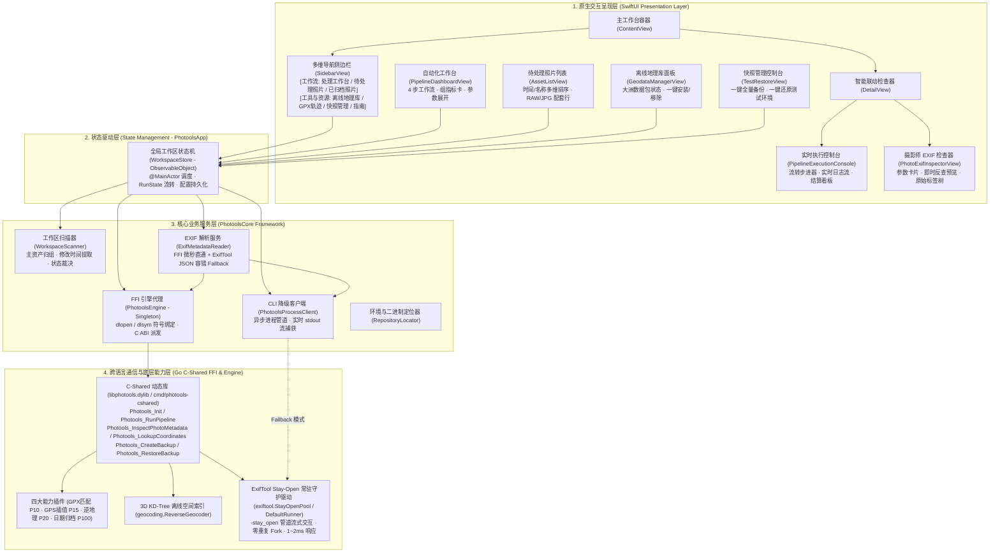
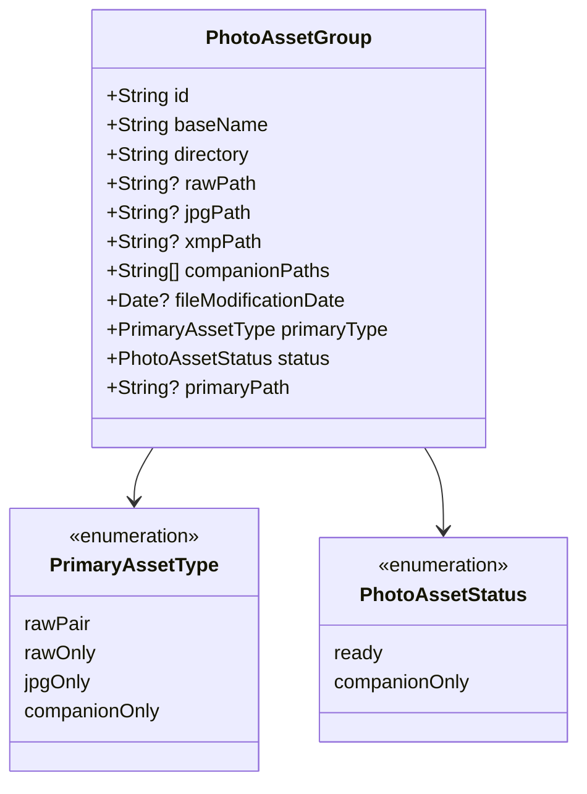
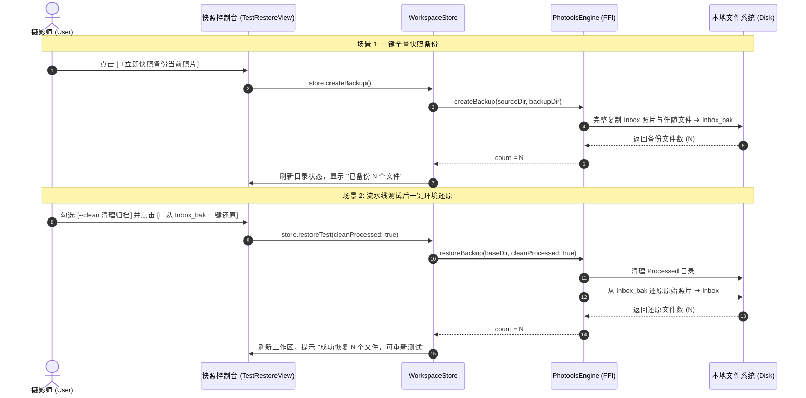

# 🍏 photools macOS 原生客户端架构与技术设计文档 (MACOS_CLIENT_TECHNICAL_DESIGN.md)

本文档详细记录 `photools` macOS 原生客户端（`macos/PhotoolsApp`）的总体系统架构、UI/UX 交互设计规范、Swift 与 Go (C-Shared FFI) 跨语言通信协议、主资产模型、EXIF 深度解析流水线、离线地理即时预览以及测试快照管理体系。

---

## 1. 总体架构与系统分层 (System Architecture)

Photools macOS 客户端采用 **SwiftUI + Swift Concurrency (TEA / Store 模式) + PhotoolsCore 底层库 + Go C-Shared FFI (libphotools.dylib) + CLI 进程 Fallback** 的混合架构。



---

## 2. 跨语言 (Swift ⇄ Go C-Shared) 接口与内存安全契约

为了实现原生界面的极致响应速度，客户端优先通过 `dlopen` 加载 `libphotools.dylib` 进行进程内 C-ABI 直通调用（调用开销 $< 0.1\text{ms}$，内存零拷贝/单例常驻），在未找到动态库时自动无缝降级为 CLI 子进程模式。

### 2.1 导出的 C-ABI 核心符号规范

| C 导出符号名称 | 作用与功能 | 性能指标 | 内存管理契约 |
| :--- | :--- | :--- | :--- |
| `Photools_Init` | 异步预热四大核心插件与 3D KD-Tree 离线空间索引 | 进程内单例 `sync.Once` | C 回调函数指针通知进度 |
| `Photools_RunPipeline` | 执行包含 GPX 匹配、GPS 插值、逆地理、归档的完整流水线 | 异步 Goroutine | 通过 `bridge_event_cb` 与 `bridge_done_cb` 派发事件 |
| `Photools_InspectPhotoMetadata` | 深度读取照片拍摄参数、曝光四要素、GPS与全部标签 | $\approx 20\text{ms}$ | 返回 JSON 字符串，Swift 必须调用 `Photools_FreeString` 释放 |
| `Photools_LookupCoordinates` | 根据经纬度海拔反查规范中文行政区划与 POI | $\approx 0.05\text{ms}$ (3D KD-Tree) | 返回 JSON 字符串，Swift 必须调用 `Photools_FreeString` 释放 |
| `Photools_ListGeodataPacks` | 列出全球各大洲离线数据包安装状态与点位统计 | 内存直读 $< 1\text{ms}$ | 返回 JSON 字符串，Swift 必须调用 `Photools_FreeString` 释放 |
| `Photools_InstallGeodata` | 下载并安装指定大洲离线数据包并热重载空间树 | 异步下载流 | C 回调实时回传下载日志 |
| `Photools_RemoveGeodata` | 卸载指定大洲离线数据包并重置索引 | $< 50\text{ms}$ | 返回状态码 `0` 成功，`-1` 失败 |
| `Photools_CreateBackup` | 将 Inbox 目录全量原始文件快照复制到 `Inbox_bak` | 纯 I/O 文件流 | 返回备份成功文件数，`-1` 失败 |
| `Photools_RestoreBackup` | 从 `Inbox_bak` 还原至 Inbox（可清空 Processed） | 纯 I/O 文件流 | 返回还原成功文件数，`-1` 失败 |
| `Photools_CancelTask` | 取消正在执行的流水线任务上下文 (`context.CancelFunc`) | 立即生效 | 无内存分配 |
| `Photools_FreeString` | 释放 Go 端 `C.CString` 分配的堆内存 | 瞬时 | 严禁重复释放或野指针调用 |

### 2.2 Swift 端内存安全封装示例

```swift
public func inspectPhotoMetadata(filePath: String) -> ExifMetadata? {
    guard let fnInspectPhotoMetadata else { return nil }

    // 使用 withCString 保证 C 字符串指针在闭包内生命周期有效
    let cStr = filePath.withCString { cPath in
        fnInspectPhotoMetadata(cPath)
    }
    guard let cStr else { return nil }
    
    // 强制 defer 确保 C 堆内存必定释放，杜绝内存泄漏
    defer { fnFreeString?(cStr) }

    let jsonString = String(cString: cStr)
    guard let data = jsonString.data(using: .utf8),
          let dict = try? JSONSerialization.jsonObject(with: data) as? [String: Any] else {
        return nil
    }

    return ExifMetadata.parse(from: dict, fallbackPath: filePath)
}
```

---

## 3. 摄影资产模型与 EXIF 深度提取流水线

### 3.1 资产主文件优先模型 (Primary Asset Model)

在摄影师日常拍摄中，同一次快门释放通常生成 basename 相同的配套文件（如 `DSC_8021.NEF` + `DSC_8021.JPG` + `DSC_8021.xmp`）。



- **主决策源 (`primaryPath`)**：
  - 若包含 RAW（`NEF`/`CR3`/`ARW` 等），以 RAW 为主决策源，GPX 匹配与推算优先写入 RAW，再同步至伴随的 JPG 和 XMP；
  - 若仅有单 JPG 或单 RAW，直接以该文件为主决策源；
  - 若仅有 XMP/WAV 无主文件，判定为 `companionOnly`（良性跳过）。
- **指标统计口径**：
  - 处理工作台以**配套后的组数（Asset Groups）**为核心指标展示（如“待处理资产: 10 组”），副标题标注包含的散落文件总数。

### 3.2 多厂商 EXIF 深度提取与字段优先级清洗

为了彻底解决相机镜头型号、曝光参数因不同厂商/格式标签命名差异而解析失败（显示 `--`）的问题，后端 `internal/exiftool/exiftool.go` 实现了统一的 `InspectPhotoMetadata` 抽象：


---

## 4. UI/UX 界面设计与交互规范

系统全面遵循 **Apple Human Interface Guidelines (HIG)**，去除了 70% 开发端技术术语，全流程以摄影师直觉语言驱动。

### 4.1 4 步自动化工作流设计 (Pipeline Dashboard)

界面以卡片化展开步进器呈现四大核心能力：

1. 🧭 **第 1 步：GPX 轨迹精准匹配与 GPS 写入**
   - 依据 GPX 轨迹时间轴为照片 RAW 写入高精 GPS 坐标并二次校验；
   - 展开配置：时钟偏移补偿 `geosync`。
2. ⚡️ **第 2 步：GPS 智能时间权重推算 (Anchor Index)**
   - 自动在内存按日期构建时间锚点索引，针对未命中轨迹的照片进行球面大圆插值与近邻机位继承；
   - 展开配置：推算时间窗口选择器（`15m` / `30m` / `1h` / `2h`）。
3. 🗺️ **第 3 步：离线高精逆地理编码与中文地名写入**
   - 基于离线 3D KD-Tree 毫秒级空间索引，写入国家、省份、城市、区县和自然景区 POI（IPTC/XMP）；
   - 展开配置：无 GPS 照片软降级容错开关（`allow-no-gps`）。
4. 📅 **第 4 步：规范拍摄日期归档与结构化重命名**
   - 提取原始拍摄日期，将配套资产整组重命名并移动归档至 `Processed/YYYY/MMDD/`；
   - 展开配置：扁平原地模式（`flat`）与原地重命名（`in-place`）。

### 4.2 第三栏智能联动检查器 (Smart Dual-Mode DetailView)

第三栏（DetailView）根据左侧与中间选中项实现全自动智能形态切换：


### 4.3 未反地理编码照片“即时反查预览”交互 (Live Geocode Preview)

在待处理照片检查器中，针对不同 GPS 状态的照片提供差异化交互：

- **已有 GPS 且已写入地名**：显示绿色徽章 `已写入地名` 与中文地名摘要；
- **已有 GPS 但尚未写入地名**：
  - 显示蓝色标签 `📍 已有 GPS (31.2304°, 121.4737°) · 未写入地名`；
  - 醒目提供 **`[✨ 点击即时预览逆地理中文地名]`** 按钮；
  - 用户点击后，毫秒级调用本地 3D KD-Tree 引擎反查，在卡片中即时高亮展示：
    $$\text{反查预览: 中国 · 上海市 · 黄浦区 · 外滩 (时区: Asia/Shanghai · 海拔: 12m · 距离: 0.12km)}$$
    并提示用户：“执行流水线时将全自动把此规范中文地名写入 IPTC/XMP 标签”。
- **无 GPS 坐标照片**：
  - 显示橙色标签 `⚠️ 无 GPS 坐标`，友好提示将在执行流水线时通过 GPX 轨迹或同批次前后机位时间推算补全。

### 4.4 待处理照片多维排序系统 (Multi-dimensional Sorting)

在 `AssetListView` 顶部提供即时排序选择器：
- 📅 **时间（旧 → 新）**（默认按照片实际拍摄时间先后正序排列）
- 📅 **时间（新 → 旧）**（最近拍摄的照片在前）
- 🔤 **名称（A → Z）**
- 🔤 **名称（Z → A）**

每行照片列表（`AssetRow`）下方清晰渲染拍摄时间（如 `2026-08-25 09:30:15`），彻底杜绝跨卷与特殊命名下的乱序问题。

### 4.5 常驻底部状态栏与写入策略防呆中枢 (Status Bar & Policy Protection)

针对摄影师在执行流水线前“无法感知当前策略、盲目直接执行”的核心痛点，建立全局常驻底部状态栏（`statusBarView`）：

- **全景色彩徽章**：以高质感圆角胶囊呈现当前元数据保护级别：
    - `smart`: `[🌟 策略: 智能分层模式 ▾]`（绿色 · RAW 写 GPS/时间 + 仅 XMP 承载地名，JPG 全写入）
    - `sidecar_only`: `[🛡️ 策略: 纯 XMP 侧车模式 ▾]`（安全蓝 · RAW/JPG 绝对只读保护）
    - `embed_and_sidecar`: `[📝 策略: 双写同步模式 ▾]`（紫色 · 原图与 XMP 均同步写入）
    - `embed_only`: `[⚠️ 策略: 纯原图内嵌写入 ▾]`（警示橙 · 仅写入原图内嵌 EXIF）
- **杜绝 NSPopUpButton 吞噬缺陷**：避免 `Menu` 嵌套 `Picker` 导致 AppKit 强制抹除自定义 Label 仅剩箭头的系统缺陷，使用原生带
  `checkmark` 的 `Button` 列表结合 `.buttonStyle(.plain)` 与 `.fixedSize()` 渲染；
- **UI/UX 极致去冗余**：移除了执行主大按钮下方的重复提示条与顶部 Header 的重复待处理胶囊，确立状态栏为唯一的全局策略中枢与操作前防呆确认点。

### 4.6 已归档照片 (Processed) 目录层级下探与极地冰蓝冻结 UI 体系

为满足摄影师对历史已归档资产的浏览、下探与安全检查需求，侧边栏“已归档照片”提供与待处理等齐的完整管理面板：

- **双重浏览架构**：
    1. **子目录层级下探 (Hierarchical Drill-Down，默认)**：依据 `Processed/YYYY/MMDD/...` 物理目录树提取直接子文件夹（
       `ProcessedFolderItem`，按日期倒序排列），点击深入下探；顶部常驻面包屑导航条（`[📁 Processed > 2026 > 0101]`
       ），支持一键点击祖先节点返回；
    2. **全局递归平铺模式 (Recursive Flat Mode)**：右上角提供 `[目录 / 平铺]` 切换开关，平铺时无视层级打平展示所有归档照片，并标注相对归档日期路径；
    3. **类型筛选与文件名搜索**：支持全部/有GPS/无GPS/RAW+JPG/单RAW等类型筛选，修复了系统 Picker 造成的“全部 全部”重复
       Label 缺陷（规范化为 `筛选: [ 全部 ▾ ]`）。
- **极地冰蓝冻结只读视觉体系 (Arctic Frost Theme)**：
    - 视觉心智区分：待处理照片（Inbox）采用活动绿/任务蓝；已归档照片（Processed）全面采用极地冰蓝（`Cyan / Frost Blue`）；
    - 列表卡片（`ArchivedAssetRow`）：缩略图角标带有冰蓝雪花 `[ ❄️ ]`，文件名旁配备安全锁盾徽章 `[ 🔒 lock.shield.fill ]`
      ，副标题等宽展示相对归档路径；
    - 右键上下文菜单移除“删除”等破坏性操作，仅保留定位、打开与拷贝 GPS 等安全只读操作；
    - 右侧元数据面板（`PhotoExifInspectorView`）：顶部常驻微磨砂质感的 `❄️ 已归档资产 (只读冻结保护) [FROZEN]` 保护横幅。
- **统计口径严格统一（资产主文件优先模型）**：
    - 侧边栏“归档目录”与工作台“已归档”指标卡片的徽章数量，由底层物理碎文件总数（如 177 = 59组 × 3个文件）统一修正为摄影资产组数（
      `processedAssetGroupCount`，59 组照片），使侧边栏、列表头部与详情统计 100% 保持一致。

### 4.7 全键盘极速看图与系统原生 QuickLook 浮层联动

深度贯彻 macOS 摄影师全键盘高效看图与挑图工作流：

- **空格键 (Space) 即开即关**：在待选照片或归档照片列表中，按空格键瞬间唤起系统级 QuickLook 大图浮层（优先采用极速 JPG
  伴随文件，无 JPG 时自动加载 RAW 原片），再次按空格或 Esc 即刻关闭；
- **解决焦点转移下的方向键切图难题**：
    - 针对 QuickLook 弹出成为 Key Window 时背部 List 失去焦点导致方向键失效的问题，接入进程级 **
      `NSEvent.addLocalMonitorForEvents(matching: .keyDown)`** 监听器；
    - 捕获 `↑ / ↓ / ← / →` 方向键，无缝调用 `selectNextAsset()` / `selectPreviousAsset()`；
    - 在当前筛选与搜索结果（`currentDisplayedAssets`）内连续平滑切图，并通过 **`QLPreviewPanel.shared().reloadData()`** 强制让
      QuickLook 浮层毫秒级同步重载大图；
    - 配合 **`ScrollViewReader`** 实现背部列表自动居中滚动跟焦；
- **打字防误触保障**：通过 `@FocusState` 严格检测焦点，当用户在搜索框（`NSTextView`）打字输入带空格内容时，绝不拦截按键。

### 4.8 核心拍摄时间高亮等宽半加粗蓝色展示

在照片 EXIF 检查器（`PhotoExifInspectorView`）与 GPS 元数据卡片（`CopiedGPSInspectorSheet`）中，日历图标与时间数值（
`DateTimeOriginal`）统一采用高亮等宽半加粗蓝色（`Color.blue`）展示，强化关键时间事实的可读性与专业摄影元数据排版质感。

---

## 5. 快照管理与测试环境还原体系 (Snapshot & Restore)

为了保障摄影师测试与批量处理过程中的资产安全，客户端提供了完整的双向快照控制台（`TestRestoreView`）：



---

## 6. 项目结构与核心源文件索引

```
macos/PhotoolsApp/
├── Package.swift                                  # SPM 依赖管理与编译配置
├── Sources/
│   ├── PhotoolsCore/                            # 核心业务逻辑与跨语言代理框架
│   │   ├── Models/
│   │   │   ├── ExifMetadata.swift                 # 完整结构化拍摄参数与 EXIF 模型
│   │   │   ├── GeodataModel.swift                 # 离线地理数据包与反查结果模型
│   │   │   ├── PhotoAssetGroup.swift              # 摄影资产单元与主文件模型
│   │   │   ├── PhotoolsCommand.swift              # CLI 命令装配器
│   │   │   └── WorkspaceSummary.swift             # 工作区全景统计模型
│   │   └── Services/
│   │       ├── ExifMetadataReader.swift           # 异步 EXIF 提取服务 (FFI 优先 + CLI Fallback)
│   │       ├── PhotoolsEngine.swift             # C-Shared FFI 符号动态加载与代理 (单例)
│   │       ├── PhotoolsProcessClient.swift        # CLI 子进程异步管道客户端
│   │       ├── RepositoryLocator.swift            # 运行环境、二进制与动态库定位器
│   │       └── WorkspaceScanner.swift             # 目录扫描、主资产归组与时间提取
│   └── PhotoolsApp/                             # 原生 SwiftUI 界面与状态驱动
│       ├── PhotoolsApp.swift                    # 应用程序入口
│       ├── Stores/
│       │   └── WorkspaceStore.swift               # 全局响应式状态机与设置持久化
│       └── Views/
│           ├── ContentView.swift                  # 主窗口导航与工具栏
│           ├── SidebarView.swift                  # 分组侧边栏
│           ├── PipelineDashboardView.swift        # 4 步自动化流水线工作台
│           ├── AssetListView.swift                # 待处理/已归档照片列表与多维排序
│           ├── GeodataManagerView.swift           # 离线地理库数据包管理面板
│           ├── TestRestoreView.swift              # 快照备份与环境还原双向控制台
│           ├── DetailView.swift                   # 智能联动右侧检查器容器
│           └── Components/
│               ├── PhotoExifInspectorView.swift   # 摄影师拍摄参数看板与即时反查预览
│               └── PipelineExecutionConsole.swift # 实时执行控制台与日志看板
└── Tests/
    └── PhotoolsCoreTests/                       # 核心业务单元测试套件 (17 项测试 100% 覆盖)
        ├── ExifMetadataReaderTests.swift
        ├── GeodataModelTests.swift
        ├── PendingReportParserTests.swift
        ├── PhotoAssetGroupTests.swift
        ├── PhotoolsEngineTests.swift
        ├── PhotoolsCommandTests.swift
        └── WorkspaceScannerTests.swift
```

---

## 7. 质量保证与测试契约 (QA & Testing)

所有核心功能均要求维持 **100% 自动化测试闭环**：

1. **Swift 单元测试**：
   ```bash
   cd macos/PhotoolsApp && swift test
   ```
   > 涵盖资产主文件归组、修改时间提取、EXIF 解析模型、FFI 动态库加载与反查、CLI 命令组装等全部 17 项测试，执行耗时 $< 0.05\text{s}$。
2. **Go 底层能力测试**：
   ```bash
   go test ./...
   ```
   > 涵盖四大能力插件、KD-Tree 离线地理检索、ExifTool 标签提取、备份还原及 TUI 全套测试。
3. **构建发布验证**：
   - `dist/libphotools.dylib`（C-Shared 动态库编译）
   - `dist/PhotoolsApp.app`（macOS Release Bundle 构建）
