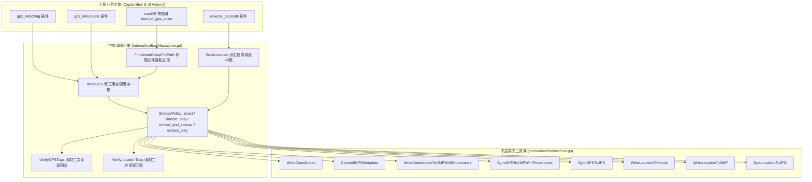

# 📸 photools 元数据分层写入调度器与职责边界架构设计

本文档作为 photools 中所有元数据写入（GPS 轨迹匹配、智能时间插值推算、快捷键手动拷贝粘贴、离线逆地理编码）的
**权威架构设计与职责边界规约规范**。

---

## 1. 架构核心思想：原子能力与策略编排彻底解耦

在过往演进中，各个能力插件（如 `gps_interpolate`、`reverse_geocode`）和客户端手动操作（如 macOS 快捷键 FFI）容易陷入**“各家各写一套
`switch SidecarPolicy`”**的坏味道，导致文件探测方式割裂、二次校验规则不一、维护成本剧增。

photools 确立的核心架构为： **下层原子工具库 + 中层策略调度引擎 + 上层业务入口**：



---

## 2. 全场景元数据写入职责边界矩阵 (Writing Boundary Matrix)

不同写入场景分属不同的摄影信息层级， **必须严格遵守操作白名单与防污染红线**：

| 写入主体                                       | 业务阶段 / 触发源                               | 信息层级                               | 允许写入的操作对象 (Allowlist)                                                                           | 严禁触碰的防污染红线 (Denylist)                                          | 溯源审计指纹 (Provenance)                                                                        |
|:-----------------------------------------------|:------------------------------------------------|:---------------------------------------|:---------------------------------------------------------------------------------------------------------|:-------------------------------------------------------------------------|:-------------------------------------------------------------------------------------------------|
| **`gpx_matching`**<br>(阶段 1 插件)            | 外部 GPX 轨迹时间轴精准匹配                     | **第二层修正事实**<br>(Corrected Fact) | • GPS 经度、纬度、海拔<br>• 卫星时间戳 (`GPSTimeStamp`/`GPSDateStamp`)                                   | ❌ **严禁触碰或写入任何中文地名**、国家/城市或 IPTC/Lightroom 标签       | `GPSSource: gpx_track`<br>`GPSMatchMethod: time_interpolation`                                   |
| **`gps_interpolate`**<br>(阶段 2 插件)         | 批次相邻机位时间有序大圆球面插值 / 近邻继承     | **第二层修正事实**<br>(Corrected Fact) | • 插值推算的 GPS 经纬度<br>• 推算海拔高度 (`GPSAltitude`)                                                | ❌ **严禁触碰或写入任何中文地名**；严禁伪造虚假的卫星时钟或编号          | `GPSSource: interpolated`<br>`GPSMatchMethod: spherical_interpolation`<br>记录时间差跨度         |
| **`manual_gps_paste`**<br>(macOS 快捷键 `⌥⌘G`) | 摄影师显式从参考机位照片 `⌘G` 拷贝并粘贴        | **第二层修正事实**<br>(Corrected Fact) | • **全量机身原生物理字段无损克隆** (13+ 项：`GPSVersionID`, `Ref`, `Datum`, `Satellites`, `DateTime` 等) | ❌ **严禁触碰目标照片现有的地名或曝光参数**；克隆时仅克隆 `-GPS:all`     | `GPSSource: manual_copied`<br>`GPSMatchMethod: clipboard_paste`<br>`Processor: photools-desktop` |
| **`reverse_geocode`**<br>(阶段 3 插件)         | 基于照片既有 GPS 坐标反查 3D KD-Tree 离线地理库 | **第三层派生信息**<br>(Derived Info)   | • 中文国家、省份、城市、区县、POI<br>• IPTC Extension 结构化位置<br>• Lightroom 分层关键词标签树         | ❌ **严禁重写、篡改或覆盖既有的物理 GPS 坐标**；RAW 格式严格只读仅写 XMP | 写入 IPTC/XMP 标准地名字段，不触碰 GPS 命名空间                                                  |
| **`date_archive`**<br>(阶段 4 插件)            | 原始拍摄日期规范化重命名与分级归档              | **第四层文件归档**<br>(File Archive)   | • 磁盘文件路径与复合扩展名                                                                               | ❌ **严禁修改任何原图或侧车的 EXIF/XMP 二进制内容**                      | 无（文件系统层原子移动）                                                                         |

---

## 3. 下层 `internal/exiftool` 原子能力库契约 (Primitives)

下层 `internal/exiftool` 专注执行 ExifTool 子进程或常驻进程池调用， **保持绝对纯净，严禁包含任何针对 `SidecarPolicy`
的分支判定**：

1. **`WriteCoordinates(runner, path, lat, lon, alt)`**：向单文件写入基础经纬度与海拔（防污染：严格限定 `-GPS:*`）；
2. **`CloneAllGPSMetadata(runner, src, tgt)`**：使用 `-TagsFromFile <src> -GPS:all <tgt>` 无损克隆全量机身物理标签；
3. **`WriteCoordinatesToXMPWithProvenance(runner, xmp, lat, lon, alt, prov)`**：写入 XMP 坐标并自动附加 `XMP-photools`
   命名空间溯源指纹；
4. **`SyncGPSToXMPWithProvenance(runner, raw, xmp, prov)`**：从 RAW 同步 GPS 至 XMP 并注入指纹；
5. **`SyncGPSToJPG(runner, raw, jpg)`**：将 RAW 中的 GPS 标签复制到伴随 JPG；
6. **`WriteLocationToMedia(runner, path, loc)`**：向图片写入中文地名与分层标签（防污染：严格限定 IPTC/XMP 地名标签）；
7. **`WriteLocationToXMP(runner, xmp, loc)`**：向 XMP 侧车写入中文地名与分层标签；
8. **`SyncLocationToJPG(runner, raw, jpg)`**：将地名从 RAW 伴随同步至 JPG；
9. **`VerifyGPSTags(runner, path)`**：二次读取校验目标文件是否存在有效 GPS 坐标；
10. **`VerifyLocationTags(runner, path)`**：二次读取校验目标文件是否存在有效国家/城市地名。

---

## 4. 中层统一调度器设计 (`internal/exiftool/dispatcher.go`)

### 4.1 第二层修正事实调度 (`WriteGPS`)

```go
func WriteGPS(runner CommandRunner, asset domain.AssetGroup, payload GPSWritePayload, policy domain.SidecarPolicy) ([]string, error)
```

- **`smart` (智能分层模式 · 默认/推荐)**：
    - **RAW EXIF 头部**：作为主决策源，克隆或写入全量高精度物理 GPS（RAW 永久拥有原生 GPS）；
    - **伴随 / 独立 JPG**：内嵌克隆或写入全量 GPS（跨设备即开即看）；
    - **配套 XMP 侧车**：
        - 若包含 RAW：必定写入/生成 `.nef.xmp` 侧车并留下指纹（RAW 摄影工作流标准规约）；
        - 若仅单 JPG：仅当原本已存在 XMP 侧车时同步更新，避免为单 JPG 凭空产生垃圾 `.jpg.xmp` 侧车；
    - **二次回验**：强制校验主文件，读回失败坚决报错。
- **`sidecar_only` (纯侧车模式)**：
    - RAW 与 JPG 原图 **100% 保持只读、不修改任何字节**！所有元数据仅写入配套 `.xmp` 侧车并注入指纹；
    - **二次回验**：强制校验 `.xmp` 侧车。
- **`embed_and_sidecar` (双写同步模式)**：
    - 写入主文件与伴随 JPG + 同步配套 XMP 侧车。
- **`embed_only` (纯原图内嵌模式)**：
    - 仅写入主文件与伴随 JPG，严禁生成或触碰任何 `.xmp` 侧车。

### 4.2 第三层派生信息调度 (`WriteLocation`)

```go
func WriteLocation(runner CommandRunner, asset domain.AssetGroup, loc domain.LocationInfo, policy domain.SidecarPolicy) ([]string, error)
```

- **`smart` 模式精确规约**：RAW 严禁为了地名修改原图，严格写入 `.nef.xmp` 侧车；JPG 作为交付格式直接内嵌写入。

### 4.3 伴随文件智能发现 (`FindAssetGroupForPath`)

- 基于 `os.ReadDir` 物理枚举同目录真实文件，精确匹配前缀相同的拍摄单元（RAW、JPG、XMP、伴随录音/调色等）；
- 彻底规避 macOS APFS 文件系统默认大小写不敏感引发的 `os.Stat` 误匹配隐患。

---

## 5. 专业软件非黑盒纪律 (Transparent Professional Principle)

1. **元数据完全透明**：在 UI 端展示“已拷贝 GPS 数据”或进行手动赋予时，必须完整呈现所有待写入的 13+ 项物理 EXIF 字段（
   `GPSVersionID`, `Ref`, `Datum`, `Satellites`, `Time`, `Position` 等），绝不能简化为经纬度黑盒；
2. **策略明确呈现**：执行写入动作前与写入后，必须明确展示当前遵循的写入策略（`smart` / `sidecar_only` 等）与具体修改的文件清单；
3. **真实错误透传**：底层执行失败时，必须将 ExifTool 真实错误诊断（而非硬编码的“请检查权限”）完整向上传递至桌面 HUD
   浮层与运行控制台日志流。
